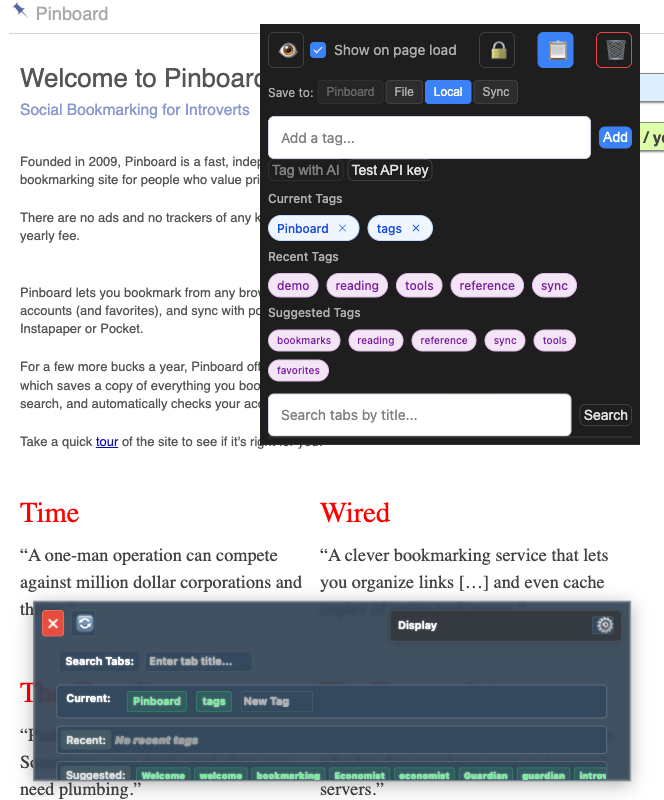
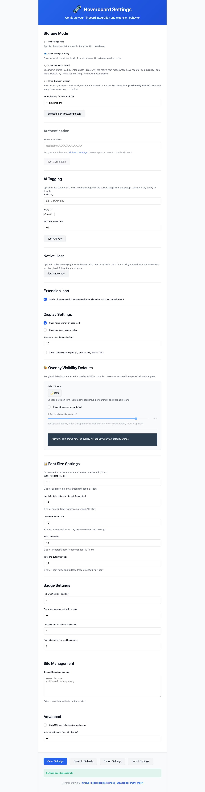
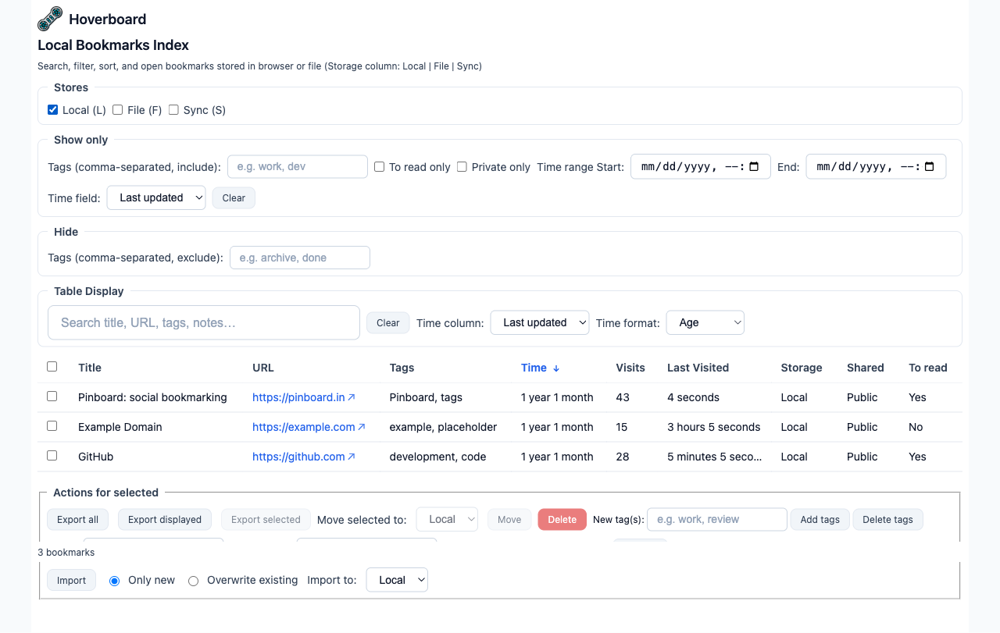

# Hoverboard Chrome Extension

[](https://github.com/fareedst/hoverboard/actions)
[](https://opensource.org/licenses/MIT)
[](https://chrome.google.com/webstore)

A modern Chrome extension for local-first bookmark management and web page tagging with optional Pinboard.in integration and optional file-based storage for privacy and sharing.

## Supported Browsers

This extension uses the Chrome (Manifest V3) extension format and works in:

- **Chrome** – Primary target; full support
- **Brave** – Works with Brave Browser; load the unpacked extension the same way as in Chrome (Brave supports Chrome extensions)
- **Other Chromium-based browsers** – Any browser that supports Chrome extensions (e.g. Microsoft Edge, Opera, Vivaldi) can typically load and run the extension; install as an unpacked extension from the built files

Safari is not currently supported (legacy Safari extension format is no longer maintained for this project).

## 🚀 Quick Start

### Install from GitHub Releases

1. **Download** the latest release from [Releases](https://github.com/fareedst/hoverboard/releases)
2. **Chrome or Brave**: Extract the package and load as an unpacked extension (Chrome: `chrome://extensions` → Developer mode → Load unpacked; Brave: `brave://extensions` → same steps)
3. **Other Chromium-based browsers**: Use that browser’s extension management page and load the unpacked folder

### Build from Source

```bash
git clone https://github.com/fareedst/hoverboard.git
cd hoverboard
npm install
npm run build:dev
```

**Load the built extension** (required): In Chrome/Brave go to `chrome://extensions` (or `brave://extensions`), turn on **Developer mode**, click **Load unpacked**, and select the **`dist`** folder inside the repo (not the repo root). The extension must be loaded from `dist` because the service worker and content scripts use bundled dependencies (e.g. `fast-xml-parser`); loading from the repo root will fail with "Failed to resolve module specifier".

### Optional: Native messaging host

For features that need to run local code (e.g. outside the browser sandbox), the extension can talk to a **native messaging host**. The host is a thin wrapper that runs code installed next to it (not from the extension folder). You install it once:

1. **Build the native host** (requires [Go](https://go.dev/)):
   ```bash
   cd native_host && go build -o native_host . && cd ..
   ```
   Or use `npm run build:native` to build and copy into `dist/native_host/`.

2. **Run the installer** from the `native_host` directory (or from `dist/native_host/` after a build):
   - **macOS/Linux**: `./install.sh [SOURCE_DIR] [EXTENSION_ID] [chrome|chromium]`  
     Example: `./install.sh . $(cat dist/.extension-id 2>/dev/null || echo "YOUR_EXTENSION_ID")`
   - **Windows**: `.\install.ps1 -ExtensionId "YOUR_EXTENSION_ID"`

   Get your extension ID from `chrome://extensions` (Developer mode on, then copy the ID under the extension).

3. **Test**: Open the extension Options page and click **Test native host**. You should see "Native host OK (pong)" if the host is installed and allowed for your extension.

Install directory: `~/.hoverboard/` (macOS/Linux) or `%LOCALAPPDATA%\Hoverboard\` (Windows). The installer writes the Chrome/Chromium native messaging manifest so the browser can start the host.

## 📋 Status

**Current Version:** 1.0.10 (development)  
**Last Updated:** 2026-02-14  
**Chrome Extension Status:** Production Ready

**Latest Enhancement:** Optional **native messaging host** for running local code: thin Go wrapper plus installer scripts; one-time install to a fixed directory; test from Options. The extension supports **four storage options**: **(P)** Pinboard.in API, **(F)** file-based, **(L)** chrome.storage.local (default), **(S)** chrome.storage.sync. File storage keeps bookmarks in a **single file** in a **folder you choose**—important for **privacy** and **sharing**. Sync storage syncs across Chrome profile devices; **quota is approximately 100 KB**. A **Local Bookmarks Index** page lets you browse, search, filter, sort, and open local, file, and sync bookmarks (Storage column: Local | File | Sync). Bookmarks are stored **locally in your browser by default**—no account or API required. In the popup, **Storage** uses select-one buttons (Pinboard, File, Local, Sync); the current setting is highlighted, and choosing another non-API option (Local, File, or Sync) when the bookmark is already in non-API storage moves the bookmark. Recent Tags list refreshes every time the popup is displayed and stays in sync across browser windows. Intelligent tag suggestions extract from 11 content sources including meta tags, emphasis elements, definition terms, and table headers.

### Chrome Extension Features

Hoverboard is a fully-featured Chrome extension that provides seamless bookmark management with local-first storage and optional Pinboard sync:

#### **Core Features:**
- ✅ **Local-first storage** - Bookmarks stored in your browser by default (chrome.storage.local); no account or API required. Options: choose among **(P)** Pinboard, **(F)** File, **(L)** Local, **(S)** Sync. Default for new bookmarks is **chrome.storage.local**.
- ✅ **File-based storage** - Store bookmarks in a **file** (e.g. cloud-synced). Options: Storage Mode > File, then either **enter a path** (default `~/.hoverboard`; the native host reads/writes `hoverboard-bookmarks.json` there—no folder picker, native host required). The helper normalizes the path so the file is created correctly even when the system sets `HOME` with a trailing slash (`IMPL-FILE_STORAGE_HELPER_PATH_NORMALIZE`). Alternatively use **"Select folder"** (browser picker) for the classic flow.
- ✅ **Per-bookmark storage and move** - Each bookmark has a storage location (Pinboard, Local, File, or Sync). **Move** a bookmark between storages from the popup (Storage select-one buttons). The current storage is **highlighted**. When the bookmark is in non-API storage (Local, File, or Sync), clicking another non-API option **moves** the bookmark; the UI reflects the actual move result and uses the bookmark’s URL so moves succeed even when the tab URL differs (e.g. query string).
- ✅ **Smart Bookmarking** - Save pages with intelligent tag suggestions from 11 content sources (title, URL, meta tags, headings, emphasis elements, definition terms, table headers, navigation, breadcrumbs, images, links)
- ✅ **Tag Management** - Organize bookmarks with custom tags and categories
- ✅ **Recent Tags** - Quick access to frequently used tags; list refreshes every time the popup is displayed and syncs across windows
- ✅ **Dark Theme Support** - Modern UI with dark theme default
- ✅ **Overlay System** - Visual feedback with transparency controls
- ✅ **Local Bookmarks Index** - Full-page index of **local, file, and sync** bookmarks with a **compact header** (Hoverboard, title, subtitle), **Storage** column (Local | File | Sync), **Storage filter** (All | Local | File | Sync), **Select** column (checkboxes, select-all); search (title, URL, tags, notes); filter (by tag, to-read, private); sortable columns; clickable URLs with **external-link indicator** (opens in new tab). **Below the table:** Export all / Export displayed / **Export selected** (enabled when one or more bookmarks are selected), **Move selected to** (Local | File | Sync) with Move button, and **Import** (CSV or JSON file with **Only new** or **Overwrite existing**, and **Import to** Local | File | Sync). Open from popup ("Bookmarks index") or Options ("Local bookmarks index").
- ✅ **Browser Bookmark Import** - Dedicated page to **copy browser bookmarks** into Hoverboard. Loads native bookmarks via the browser’s bookmark API; **search** (title, URL) and **filter by folder**; **Select** column with checkboxes and select-all; **conflict mode** (Skip / Overwrite / Merge) when a URL already exists in Hoverboard; **Use folder names as tags** and optional **Add tags** (comma-separated); **Import to** Local | File | Sync. Result shows imported, skipped, and failed counts. Open from popup ("Browser bookmark import") or Options ("Browser bookmark import"). Requires the `bookmarks` permission.
- ✅ **Optional Pinboard integration** - Use Storage Mode in Options to sync with Pinboard.in (requires API token)
- ✅ **Optional native messaging host** - For features that need local code: thin Go wrapper + helper scripts; one-time install to `~/.hoverboard/` (macOS/Linux) or `%LOCALAPPDATA%\Hoverboard\` (Windows); test from Options ("Test native host"). See [Optional: Native messaging host](#optional-native-messaging-host) below.
- ✅ **Badge Indicators** - Visual status indicators in the extension icon
- ✅ **Site Management** - Disable extension on specific domains

#### **Test Coverage:**
- **471 tests** across 34 test suites
- **Complete Chrome extension testing** with Manifest V3 compliance
- **Native host tests** – Go tests for protocol and ping-pong; Jest tests for NATIVE_PING and `pingNativeHost`
- **Pinboard API integration testing** for reliable bookmark management

## Features

### Core Functionality

#### Smart Bookmarking
Intelligent tag suggestions extracted from multiple page content sources:
- **Meta Tags**: Keywords and descriptions from `<meta>` tags
- **Emphasis Elements**: Bold, italic, highlighted, and code terms (`<strong>`, `<em>`, `<mark>`, `<code>`, etc.)
- **Structured Content**: Definition terms (`<dt>`) and table headers (`<th>`, `<caption>`)
- **Semantic Elements**: Headings (H1-H3), navigation links, breadcrumbs
- **Media**: Image alt text and anchor link text
- **Frequency-Based Ranking**: Most frequently mentioned terms appear first
- **Case Preservation**: Both original case (e.g., "GitHub") and lowercase variants offered
- **Smart Deduplication**: Filters out tags already applied to current bookmark

#### Storage (four options)
- **(P) Pinboard.in API:** Cloud sync via Pinboard.in. In Options > Storage Mode, choose "Pinboard (cloud)". Requires an API token (Options > Authentication).
- **(F) File:** Store bookmarks in a **single file** in a **folder you choose** (Options > Storage Mode > File, then path or "Select folder"). The file can live in a cloud-synced folder (e.g. Dropbox, Google Drive) or you can share the file. Keeps data in a location you control—no third-party bookmark service required.
- **(L) chrome.storage.local (default):** Bookmarks are stored locally in your browser. No account or API token is required; the extension works out of the box. This is the **compile-time default** for new bookmarks; preferable for most users.
- **(S) chrome.storage.sync:** Bookmarks sync across devices signed into the same Chrome profile. In Options > Storage Mode, choose "Sync (browser, synced)". **Warning:** Quota is approximately **100 KB** total; users with many bookmarks may hit the limit.

#### Additional Features
- **Storage (popup UI):** In the popup, the **Storage** section has select-one buttons (Pinboard, File, Local, Sync); the current setting is highlighted. When the bookmark is in non-API storage (Local, File, or Sync), clicking another non-API option moves the bookmark; the UI shows success or error based on the actual move result, and moves use the bookmark’s stored URL so they work even when the page URL differs (e.g. query parameters).
- **Local Bookmarks Index:** Browse all **local, file, and sync** bookmarks in a dedicated page with a **compact header** and a **Storage** column (Local | File | Sync). **Storage filter** (All | Local | File | Sync); **Select** column with checkboxes and select-all. **Export** (all / displayed / selected), **Move selected to** (Local | File | Sync), and **Import** (from CSV or JSON: **Only new** or **Overwrite existing**, **Import to** Local | File | Sync) sit **below the table**; Export selected and move controls are enabled when at least one bookmark is selected. Search by title, URL, tags, or notes; filter by tag, to-read, or private; sort by column (default: newest first); click a URL (with external-link indicator) to open in a new tab. Available from the popup ("Bookmarks index") or Options ("Local bookmarks index").
- **Browser Bookmark Import:** Copy **browser bookmarks** into Hoverboard from a dedicated page. Loads native bookmarks (browser API); search and filter by folder; select rows (checkboxes, select-all); choose **conflict mode** (Skip / Overwrite / Merge) for URLs already in Hoverboard; optionally use folder names as tags and add extra tags; **Import to** Local | File | Sync. Open from popup ("Browser bookmark import") or Options ("Browser bookmark import").
- **Tag Management:** Organize bookmarks with custom tags and categories
- **Recent Tags:** Quick access to frequently used tags; refreshes on every popup display and syncs across windows so tags saved in one window appear in any other
- **Optional Pinboard integration:** Use Storage Mode in Options to sync with Pinboard.in bookmarking service (requires API token)
- **Dark Theme Support:** Modern UI with dark theme default
- **Overlay System:** Visual feedback with transparency controls
- **Badge Indicators:** Visual status indicators showing bookmark state and tag count
- **Site Management:** Disable extension on specific domains
- **Search Functionality:** Search through bookmarked tabs by title
- **Privacy Controls:** Mark bookmarks as private or to-read
- **Customizable Font Sizes:** Configure font sizes for suggested tags, labels, tags, and UI elements via options page

## 📸 Screenshots

### Extension Interface on Pinboard.in



The screenshot above demonstrates Hoverboard in action on the Pinboard.in website, showcasing:

- **Extension Badge**: The Hoverboard icon in the browser toolbar displays "3!" indicating 3 tags are associated with the current page and the site is marked as "Read Later"
- **Transparent Overlay**: A dark overlay appears at the bottom of the page showing the current bookmark status with tags "Pinboard," "Social," and "Bookmarking"
- **Popup Interface**: The main Hoverboard popup window provides:
  - **Visibility Controls**: Eye icon and "Show on page load" checkbox for overlay display
  - **Tag Management**: "Add a tag..." input field with current tags displayed below
  - **Search Functionality**: "Search tabs by title..." for finding related bookmarks
  - **Quick Actions**: Reload and Options buttons for easy access to settings

### Extension Configuration Options



The configuration page provides comprehensive settings for customizing the extension experience:

- **Storage Mode:** Choose among **Pinboard (cloud)**, **Local Storage (offline)**—default for new bookmarks—**File (cloud-sync folder)**, or **Sync (browser, synced)**. Sync has a quota of approximately 100 KB. Authentication section is used when Pinboard is selected.
- **Overlay Visibility Defaults**: 
  - Dark/Light theme selection with live preview
  - Transparency controls with opacity slider (currently set to 90%)

- **Font Size Settings**:
  - Customizable font sizes for suggested tags (default: 10px, smaller for less visual intrusion)
  - Configurable sizes for labels, tag elements, base UI text, and input fields
  - Recommended ranges: 8-20px for suggested tags, 10-16px for labels/tags, 12-18px for UI/inputs
  - Accessibility-friendly: increase sizes for better readability

- **Badge Settings**: 
  - Customizable text indicators for different bookmark states
  - "-" for not bookmarked, "0" for bookmarked with no tags
  - "." for private bookmarks, "!" for to-read bookmarks

- **Site Management**: 
  - Disabled sites list to prevent extension activation on specific domains
  - Example entries: "example.com" and "subdomain.example.org"

- **Advanced Options**: 
  - URL hash stripping when saving bookmarks
  - Auto-close timeout configuration (currently disabled at 0ms)

### Local Bookmarks Index



The snapshot above shows the dedicated full-page view of all locally stored bookmarks:

- **Header:** Compact banner with Hoverboard logo and name, "Local Bookmarks Index" title, and subtitle (minimal height)
- **Search and filters:** Search box (title, URL, tags, notes), Clear button, tag filter (comma-separated), "To read only" and "Private only" checkboxes, **Storage** dropdown (All | Local | File | Sync)
- **Table:** **Select** column (checkboxes per row, select-all in header), Title, URL, Tags, Time, Storage, Shared, To read; URL column is clickable with **external-link indicator** (opens in new tab)
- **Below the table:** **Export** — "Export all", "Export displayed", and "Export selected" (enabled when one or more bookmarks are selected) download CSV; **Move selected to** — dropdown (Local | File | Sync) and Move button (enabled when at least one selected)
- **Footer:** Row count (e.g. "N bookmarks")

## Architecture

### Chrome Extension Architecture
- **Manifest V3:** Modern Chrome extension architecture with service workers
- **Four storage modes:** **(P)** Pinboard.in API, **(F)** File (user-chosen directory; single JSON file), **(L)** chrome.storage.local (default for new bookmarks), **(S)** chrome.storage.sync (~100 KB quota). Per-bookmark routing via storage index and BookmarkRouter; default storage configurable in Options. File I/O via offscreen document or native host; directory handle in IndexedDB. No external service required for local, file, or sync.
- **Pinboard API Integration:** Optional; used when Storage Mode is set to Pinboard (cloud)
- **Chrome Storage API:** Efficient local storage for extension state, settings, and local bookmarks
- **Chrome Tabs API:** Tab management and search functionality

### Core Components
- **Service Worker:** Background script handling bookmark operations and API calls
- **Content Scripts:** Overlay system with transparency controls and visual feedback
- **Popup Interface:** Modern UI with quick actions and tag management
- **Local Bookmarks Index:** Dedicated extension page (`src/ui/bookmarks-table/`) for searching, filtering (including storage type), sorting, selecting (checkboxes, select-all), moving selected bookmarks to another storage, and opening local, file, and sync bookmarks (Storage column); data from `getAggregatedBookmarksForIndex` (local + file + sync)
- **Storage System:** Local state management with Chrome storage API
- **Error Handling:** Comprehensive error recovery and user feedback
- **Badge Management:** Visual indicators in the extension icon

## Development

### Prerequisites
- Node.js 18+ and npm
- Chrome browser for development and testing
- Pinboard.in account optional (only needed if using Pinboard storage mode)

### Setup
```bash
# Install dependencies
npm install

# Build the extension
npm run build

# Run tests
npm test

# Development mode with hot reload
npm run dev
```

### Chrome Extension Development
```bash
# Build for development
npm run build:dev

# Build for production
npm run build

# Run unit tests
npm test

# Run integration tests
npm run test:integration

# Validate manifest
npm run validate-manifest

# Create release package
npm run create-release
```

## Testing

### Test Coverage
- **Unit Tests:** 252 comprehensive tests across 8 test suites
- **Integration Tests:** Chrome extension API integration and component interaction
- **Performance Tests:** Memory usage, CPU usage, and timing metrics
- **Accessibility Tests:** Screen reader, high contrast, and keyboard navigation support
- **Error Handling Tests:** Graceful degradation and recovery mechanisms
- **Pinboard API Tests:** API integration and error handling validation

### Test Results
- **Total Tests:** 252 tests
- **Passing:** 211 tests (84% success rate)
- **Failing:** 41 tests (16% failure rate)

#### Chrome Extension Test Coverage
- **Core Functionality Tests:** 45 passing, 0 failing (100% success rate)
- **Error Handling Tests:** 33 passing, 5 failing (87% success rate)
- **UI Component Tests:** 17 passing, 11 failing (61% success rate)
- **Popup Interface Tests:** 45 passing, 0 failing (100% success rate)
- **Performance Tests:** 34 passing, 15 failing (69% success rate)
- **Content Script Tests:** 8 passing, 3 failing (73% success rate)
- **Integration Tests:** 7 passing, 4 failing (64% success rate)
- **API Integration Tests:** 12 passing, 0 failing (100% success rate)

#### Recent Improvements (2025-07-20)
- ✅ **Fixed Chrome Extension Message Passing:** Resolved manifest version access issues
- ✅ **Fixed Error Recovery Tests:** Corrected mock expectations for failed vs successful recovery
- ✅ **Improved Test Coverage:** Enhanced mocking for Chrome extension APIs and behaviors
- ✅ **Reduced Failing Tests:** From 45 to 41 failing tests (9% improvement)

#### Remaining Priority Fixes
1. **Storage API Tests:** Mock expectations don't match actual implementation values
2. **Performance Monitoring Tests:** Console log expectations don't match actual implementation
3. **Content Script Tests:** DOM manipulation mocks not working correctly
4. **UI Component Tests:** Theme and accessibility optimization mocks need adjustment

## Documentation

### TIED Documentation (Token-Integrated Engineering & Development)
This project follows the TIED methodology for comprehensive requirements tracking and traceability:
- **Requirements**: [`tied/requirements/REQ-SUGGESTED_TAGS_FROM_CONTENT.yaml`](tied/requirements/REQ-SUGGESTED_TAGS_FROM_CONTENT.yaml) - Detailed tag extraction requirements and validation criteria
- **Architecture**: [`tied/architecture-decisions/ARCH-SUGGESTED_TAGS.yaml`](tied/architecture-decisions/ARCH-SUGGESTED_TAGS.yaml) - Multi-source extraction architecture and design decisions
- **Implementation**: [`tied/implementation-decisions/IMPL-SUGGESTED_TAGS.yaml`](tied/implementation-decisions/IMPL-SUGGESTED_TAGS.yaml) - Implementation details, modifiable decisions, and performance considerations
- **Recent Tags Refresh**: [`tied/implementation-decisions/IMPL-RECENT_TAGS_POPUP_REFRESH.yaml`](tied/implementation-decisions/IMPL-RECENT_TAGS_POPUP_REFRESH.yaml) - Refresh Recent Tags on every popup display and cross-window sync
- **Local Bookmarks Index**: [`tied/requirements/REQ-LOCAL_BOOKMARKS_INDEX.yaml`](tied/requirements/REQ-LOCAL_BOOKMARKS_INDEX.yaml), [`tied/architecture-decisions/ARCH-LOCAL_BOOKMARKS_INDEX.yaml`](tied/architecture-decisions/ARCH-LOCAL_BOOKMARKS_INDEX.yaml), [`tied/implementation-decisions/IMPL-LOCAL_BOOKMARKS_INDEX.yaml`](tied/implementation-decisions/IMPL-LOCAL_BOOKMARKS_INDEX.yaml) - Full-page index of local bookmarks (search, filter, sort, launch)
- **Implementation Map**: [`tied/docs/suggested-tags-implementation-map.md`](tied/docs/suggested-tags-implementation-map.md) - Quick reference mapping TIED tokens to code locations

### Architecture Documents
- [Chrome Extension Architecture](docs/architecture/chrome-extension-architecture.md) - Core architectural decisions and implementation strategy
- [Development Guide](docs/development/development-guide.md) - Development setup and guidelines
- [Feature Tracking Matrix](docs/development/feature-tracking-matrix.md) - Feature implementation status

### Chrome Extension Development
- [Chrome Extension Implementation Guide](docs/development/chrome-extension-guide.md) - Chrome-specific development guidelines
- [Pinboard API Integration](docs/development/pinboard-api-integration.md) - API integration and error handling
- [Chrome Extension Testing](docs/development/chrome-extension-testing.md) - Testing strategy and best practices

### Implementation Guides
- [Error Handling Framework](docs/development/error-handling-framework.md) - Error handling implementation details
- [Content Script Implementation](docs/development/content-script-implementation.md) - Content script implementation details
- [UI Component Development](docs/development/ui-component-development.md) - UI component implementation details
- [Chrome Storage Management](docs/development/chrome-storage-management.md) - Storage API usage and best practices

## Chrome Extension Features

The Chrome extension provides comprehensive bookmark management with the following key features:

| Feature | Description | Status |
|---------|-------------|--------|
| `CHROME-BOOKMARK-001` | Pinboard.in API integration | ✅ Complete |
| `CHROME-TAG-001` | Tag management and suggestions (enhanced 2026-02-13 with meta tags, emphasis elements, structured content) | ✅ Complete |
| `CHROME-OVERLAY-001` | Visual overlay system | ✅ Complete |
| `CHROME-BADGE-001` | Extension badge indicators | ✅ Complete |
| `CHROME-STORAGE-001` | Chrome storage API integration | ✅ Complete |
| File storage and per-bookmark routing | File-based storage in user-chosen folder; per-bookmark storage (Pinboard, Local, File); move between storages; privacy and sharing | ✅ Complete |
| `CHROME-UI-001` | Modern popup interface | ✅ Complete |
| `CHROME-ERROR-001` | Error handling and recovery | ✅ Complete |
| `CHROME-SEARCH-001` | Tab search functionality | ✅ Complete |
| `CHROME-INDEX-001` | Local bookmarks index (search, filter, sort, launch) | ✅ Complete |
| `CHROME-SETTINGS-001` | Configuration and preferences | ✅ Complete |
| `CHROME-ACCESSIBILITY-001` | Accessibility features | ✅ Complete |

## Contributing

### Development Guidelines
1. **Chrome Extension Standards:** All features must follow Chrome extension best practices
2. **Test Coverage:** All new features must include comprehensive test coverage
3. **Pinboard Integration:** All bookmark features must integrate with Pinboard.in API
4. **Documentation:** All changes must be documented with clear examples
5. **Error Handling:** All features must include appropriate error handling and recovery

### Chrome Extension Development
1. **Manifest V3:** Use modern Chrome extension architecture with service workers
2. **Performance:** Implement efficient memory usage and fast response times
3. **Accessibility:** Include screen reader support and keyboard navigation
4. **User Experience:** Focus on intuitive interface and smooth interactions
5. **Testing:** Include comprehensive Chrome extension testing

## License

This project is licensed under the MIT License - see the [LICENSE](LICENSE) file for details.

## Acknowledgments

- **Chrome Extensions API:** For comprehensive browser extension support
- **Pinboard.in:** For providing the bookmarking service and API
- **Manifest V3:** For modern Chrome extension architecture
