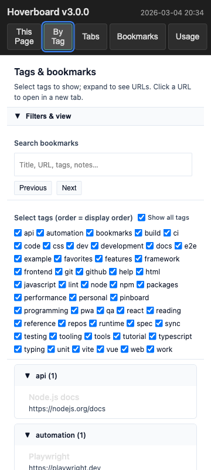
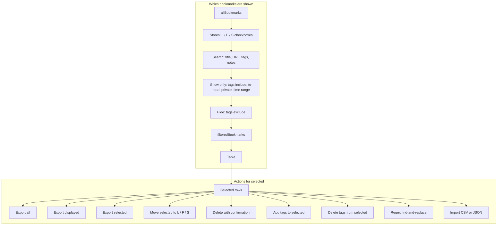
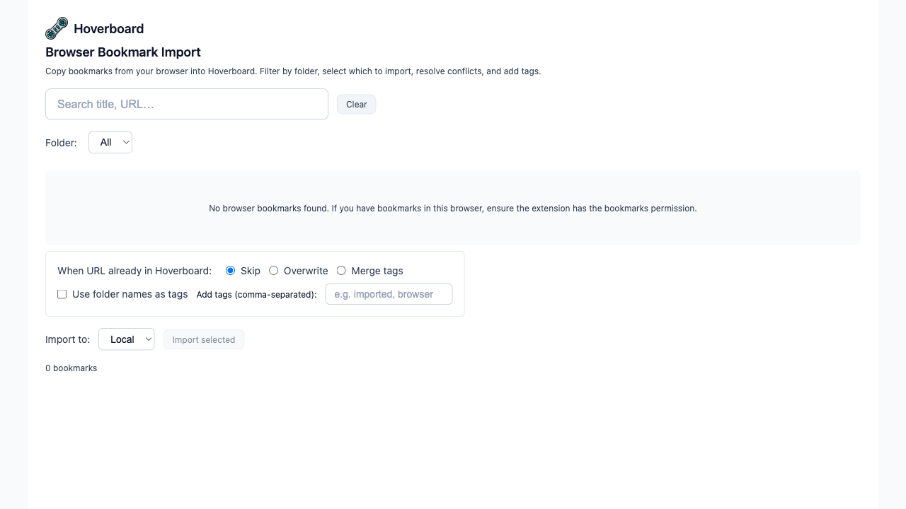
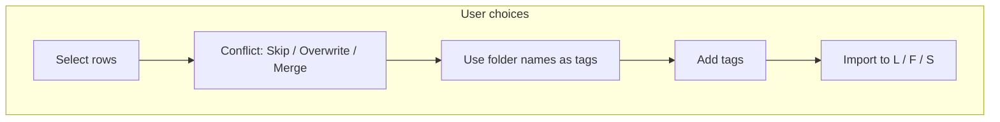
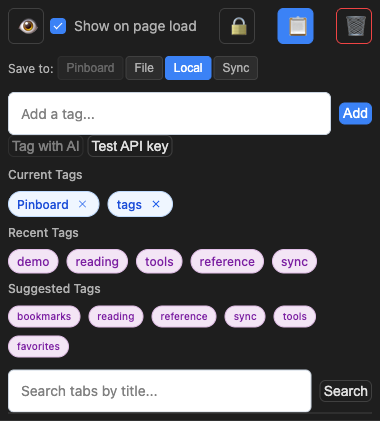

# Hoverboard Chrome Extension

[](https://github.com/fareedst/hoverboard/actions)
[](https://opensource.org/licenses/MIT)
[](https://chrome.google.com/webstore)

A modern Chrome extension for local-first bookmark management and web page tagging with optional Pinboard.in integration and optional file-based storage for privacy and sharing.

## Supported Browsers

This extension uses the Chrome (Manifest V3) extension format and works in:

- **Chrome** – Primary target; full support
- **Brave** – Works with Brave Browser; load the unpacked extension the same way as in Chrome (Brave supports Chrome extensions)
- **Other Chromium-based browsers** – Any browser that supports Chrome extensions (e.g. Microsoft Edge, Opera, Vivaldi) can typically load and run the extension; install as an unpacked extension from the built files

Safari is not currently supported (legacy Safari extension format is no longer maintained for this project).

### Extension Interface on Pinboard.in


The screenshot above shows Hoverboard on a Pinboard.in placeholder page (overlay + popup composite, dark theme; demo tags "Pinboard" and "tags"). It showcases:

- **Extension Badge**: The Hoverboard icon in the browser toolbar displays "3!" indicating 3 tags are associated with the current page and the site is marked as "Read Later"
- **Transparent Overlay**: A dark overlay at the bottom showing the current bookmark status (placeholder tags, e.g. "Pinboard" and "tags")
- **Popup Interface**: The main Hoverboard popup (dark theme) provides:
  - **Visibility Controls**: Eye icon and "Show on page load" checkbox for overlay display
  - **Tag Management**: "Add a tag..." input field with current tags displayed below; **Tag with AI** button ([REQ-AI_TAGGING_POPUP], [ARCH-AI_TAGGING_FLOW], [IMPL-AI_TAGGING_POPUP_UI]) submits the current page to the configured AI provider (OpenAI or Gemini) for tag suggestions. Page content is obtained by the extension (works even when the tab was opened before the extension was loaded); when the content script is present, Readability.js is used for main-article extraction. AI returns up to N tags (default 64). Tags you have already added to any site this session are auto-applied to the bookmark; the rest appear first in **Suggested Tags**. New bookmarks created from this flow use the default storage (local/file/sync per your default). The button is enabled only when an AI API key is set in Options and the current tab is http(s).
  - **Search Functionality**: "Search tabs by title..." for finding related bookmarks
  - **Quick Actions**: Reload and Options buttons for easy access to settings

### Extension Configuration Options


The configuration page provides comprehensive settings for customizing the extension experience:

- **Storage Mode:** Choose among **Pinboard (cloud)**, **Local Storage (offline)**—default for new bookmarks—**File (cloud-sync folder)**, or **Sync (browser, synced)**. Sync has a quota of approximately 100 KB. Authentication section is used when Pinboard is selected.
- **Overlay Visibility Defaults**: 
  - Dark/Light theme selection with live preview
  - Transparency controls with opacity slider (currently set to 90%)

- **Font Size Settings**:
  - Customizable font sizes for suggested tags (default: 10px, smaller for less visual intrusion)
  - Configurable sizes for labels, tag elements, base UI text, and input fields
  - Recommended ranges: 8-20px for suggested tags, 10-16px for labels/tags, 12-18px for UI/inputs
  - Accessibility-friendly: increase sizes for better readability

- **Badge Settings**: 
  - Customizable text indicators for different bookmark states
  - "-" for not bookmarked, "0" for bookmarked with no tags
  - "." for private bookmarks, "!" for to-read bookmarks

- **Site Management**: 
  - Disabled sites list to prevent extension activation on specific domains
  - Example entries: "example.com" and "subdomain.example.org"

- **AI Tagging** ([REQ-AI_TAGGING_CONFIG], [ARCH-AI_TAGGING_CONFIG], [IMPL-AI_CONFIG_OPTIONS], [IMPL-AI_TAG_TEST]): Optional AI API key (textbox with label), provider selector (OpenAI or Gemini), optional tag limit (default 64), and **Test API key** button. When no key is set, AI tagging is disabled; settings are persisted in config.

- **Advanced Options**: 
  - URL hash stripping when saving bookmarks
  - Auto-close timeout configuration (currently disabled at 0ms)

### Side Panel – Tags and Bookmarks Tree



The snapshot above shows the side panel with placeholder tag and bookmark data (tag selector and collapsible tree with sample URLs).

([REQ-SIDE_PANEL_TAGS_TREE], [ARCH-SIDE_PANEL_TAGS_TREE], [IMPL-SIDE_PANEL_TAGS_TREE]) A **Chrome side panel** shows a hierarchical view of bookmarks by tag (or a grouped list). Open it from the popup footer via **Tags tree**. A **Filters & view** bar can be expanded or collapsed to maximize space for the bookmarks list. When expanded, you can filter by **create time** or **last updated** (date range), **tags to include** (comma-separated), and **domains** (URL hostnames, comma-separated); set **Group by** (none, create date, update date, tag, or domain) and **Sort by** with **Sort order** (newest/oldest first). You can select one or more tags and control their display order; below that, each tag is shown with a collapsible list of bookmarks (title and URL), or when grouped, sections by the chosen axis. Clicking a URL opens it in a new tab. Config state (expanded/collapsed and filter, sort, group values) is persisted. Data comes from the same local, file, and sync bookmarks as the Local Bookmarks Index (no Pinboard in this view). The panel stays open when you switch tabs. Requires Chrome 114+ and the `sidePanel` permission.

### Local Bookmarks Index


The snapshot above shows the dedicated full-page view of all locally stored bookmarks (placeholder data):

- **Header:** Compact banner with Hoverboard logo and name, "Local Bookmarks Index" title, and subtitle (minimal height)
- **Stores:** Checkboxes for Local (L), File (F), Sync (S); no bookmarks shown until at least one is checked
- **Show only:** Tags (comma-separated, include), To read only, Private only, Time range (Start, End, Time field: Create time | Last updated)
- **Hide:** Tags (comma-separated, exclude)
- **Table Display:** Search, Time column, and Time format sit just above the table. When you scroll past this section, the Table Display block and the **table column headers** stay at the top of the viewport; the table body scrolls underneath. Actions for selected and the row count scroll with the content.
- **Bookmark count always visible:** The row count (# bookmarks) is sticky to the bottom of the viewport so it stays visible when scrolling long content. When the page is short, a flex spacer pushes it to the visual bottom. Implemented with `.footer-spacer` (flex: 1 1 0) and `.footer-info { position: sticky; bottom: 0 }`.
- **Table:** **Select** column (checkboxes per row, select-all in header), Title, URL, Tags, Time, Storage, Shared, To read; URL column is clickable with **external-link indicator** (opens in new tab)
- **Actions for selected:** Export all / Export displayed / Export selected, Move selected to (Local | File | Sync), **Delete** (confirmation with count; names if ≤8), **Add tags** and **Delete tags** (same textbox: enter tag(s) comma-separated; Add tags merges with selected bookmarks, Delete tags removes them from selected). **Regex find-and-replace:** Regex and Replacement textboxes, checkboxes for Title / URL / Tags / Notes, and **Replace** button; regex supports named groups, negative lookahead, and backreferences (JavaScript semantics). After Add tags, Delete tags, or Replace, the same records remain selected where still visible; if a record is no longer displayed (e.g. filtered out), it is no longer marked. Import
- **Footer:** Row count (e.g. "N bookmarks")

The diagram below shows which bookmarks are shown in the table and what actions are available for selected rows.



### Browser Bookmark Import



The Browser Bookmark Import page copies bookmarks from the browser into Hoverboard. It opens in a new tab and uses the same visual style as the Local Bookmarks Index.

- **Header:** Hoverboard logo, "Browser Bookmark Import" title, and subtitle describing copy-from-browser, filter by folder, select which to import, resolve conflicts, and add tags.
- **Toolbar:** Search (title, URL) with Clear button; Folder dropdown (All plus flattened folder list from browser bookmarks).
- **Empty state:** Shown when no bookmarks are found or the bookmarks API is unavailable; message explains the `bookmarks` permission.
- **Table:** **Select** column (checkboxes per row, select-all in header), Title, URL (clickable link), Folder, Date added; sortable columns.
- **Import options:** When URL already in Hoverboard: **Skip** / **Overwrite** / **Merge tags**. Checkbox "Use folder names as tags"; optional "Add tags (comma-separated)" for all imported items.
- **Import action row:** "Import to" (Local | File | Sync), "Import selected" button (enabled when at least one row is selected), and result text (imported, skipped, failed counts).
- **Footer:** Row count (e.g. "N bookmarks").

**How to open the page:**

- **From the popup:** Click **Browser bookmark import**. The page opens in a new tab (`chrome.runtime.getURL('src/ui/browser-bookmark-import/browser-bookmark-import.html')`).
- **From Options:** In the footer, click the **Browser bookmark import** link (same URL).

**How to use it:** Open the page; browser bookmarks load via `chrome.bookmarks.getTree`. Optionally search (title, URL) and filter by folder. Select rows (or use select-all), then choose conflict mode, optionally "Use folder names as tags" and "Add tags", and "Import to" (Local / File / Sync). Click **Import selected** and read the result (imported, skipped, failed). The extension must have the `bookmarks` permission.

**Example scenario:** You keep work links in a Chrome folder "Work/Projects". Open Browser Bookmark Import, set **Folder** to that path, check **Use folder names as tags**, add the tag `work`, set **Import to** to Local and **When URL already in Hoverboard** to Skip. Select all visible rows and click **Import selected**. You get Hoverboard bookmarks tagged e.g. `work`, `projects` and `work`, with duplicates skipped.

The diagram below shows the import pipeline from load through user choices to the import run.



## 🚀 Quick Start

### Install from GitHub Releases

1. **Download** the latest release from [Releases](https://github.com/fareedst/hoverboard/releases)
2. **Chrome or Brave**: Extract the package and load as an unpacked extension (Chrome: `chrome://extensions` → Developer mode → Load unpacked; Brave: `brave://extensions` → same steps)
3. **Other Chromium-based browsers**: Use that browser’s extension management page and load the unpacked folder

### Build from Source

```bash
git clone https://github.com/fareedst/hoverboard.git
cd hoverboard
npm install
npm run build:dev
```

**Load the built extension** (required): In Chrome/Brave go to `chrome://extensions` (or `brave://extensions`), turn on **Developer mode**, click **Load unpacked**, and select the **`dist`** folder inside the repo (not the repo root). The extension must be loaded from `dist` because the service worker and content scripts use bundled dependencies (e.g. `fast-xml-parser`); loading from the repo root will fail with "Failed to resolve module specifier".

### Optional: Native messaging host

For features that need to run local code (e.g. outside the browser sandbox), the extension can talk to a **native messaging host**. The host is a thin wrapper that runs code installed next to it (not from the extension folder). You install it once:

1. **Build the native host** (requires [Go](https://go.dev/)):
   ```bash
   cd native_host && go build -o native_host . && cd ..
   ```
   Or use `npm run build:native` to build and copy into `dist/native_host/`.

2. **Run the installer** from the `native_host` directory (or from `dist/native_host/` after a build):
   - **macOS/Linux**: `./install.sh [SOURCE_DIR] [EXTENSION_ID] [chrome|chromium]`  
     Example: `./install.sh . $(cat dist/.extension-id 2>/dev/null || echo "YOUR_EXTENSION_ID")`
   - **Windows**: `.\install.ps1 -ExtensionId "YOUR_EXTENSION_ID"`

   Get your extension ID from `chrome://extensions` (Developer mode on, then copy the ID under the extension).

3. **Test**: Open the extension Options page and click **Test native host**. You should see "Native host OK (pong)" if the host is installed and allowed for your extension.

Install directory: `~/.hoverboard/` (macOS/Linux) or `%LOCALAPPDATA%\Hoverboard\` (Windows). The installer writes the Chrome/Chromium native messaging manifest so the browser can start the host.

## 📋 Status

**Current Version:** 1.5.0  
**Last Updated:** 2026-02-20
**Chrome Extension Status:** Production Ready

**Latest Enhancement:** **Local Bookmarks Index – Sticky Table Display and count always visible** – When you scroll past the Table Display section, the **Table Display** block (search, Time column, Time format) and the **table column headers** stay at the top of the viewport while the table body scrolls underneath. The **bookmark count** (# bookmarks) is sticky to the bottom of the viewport so it stays visible when scrolling long content; when the page is short, a spacer pushes it to the visual bottom. Toolbar remains organized into **Stores**, **Show only**, **Hide**, and **Actions for selected** (Export, Move, **Delete**, **Add tags**, **Delete tags**, **Regex replace**, Import).

### Chrome Extension Features

Hoverboard is a fully-featured Chrome extension that provides seamless bookmark management with local-first storage and optional Pinboard sync:

#### **Core Features**
- ✅ **Local-first storage** - Bookmarks stored in your browser by default (chrome.storage.local); no account or API required. Options: choose among **(P)** Pinboard, **(F)** File, **(L)** Local, **(S)** Sync. Default for new bookmarks is **chrome.storage.local**.
- ✅ **File-based storage** - Store bookmarks in a **file** (e.g. cloud-synced). Options: Storage Mode > File, then either **enter a path** (default `~/.hoverboard`; the native host reads/writes `hoverboard-bookmarks.json` there—no folder picker, native host required). The helper normalizes the path so the file is created correctly even when the system sets `HOME` with a trailing slash (`IMPL-FILE_STORAGE_HELPER_PATH_NORMALIZE`). Alternatively use **"Select folder"** (browser picker) for the classic flow.
- ✅ **Bookmark create-time and updated-time** - Each bookmark tracks create-time (`time`) and most-recent-update-time (`updated_at`); for new records they are equal; local/file/sync set `updated_at` on save; Pinboard has only create-time so `updated_at` equals `time`. CSV export includes an optional **Updated** column.
- ✅ **Per-bookmark storage and move** - Each bookmark has a storage location (Pinboard, Local, File, or Sync). **Move** a bookmark between storages from the popup (Storage select-one buttons). The current storage is **highlighted**. When the bookmark is in non-API storage (Local, File, or Sync), clicking another non-API option **moves** the bookmark; the UI reflects the actual move result and uses the bookmark’s URL so moves succeed even when the tab URL differs (e.g. query string).
- ✅ **Smart Bookmarking** - Save pages with intelligent tag suggestions from 11 content sources (title, URL, meta tags, headings, emphasis elements, definition terms, table headers, navigation, breadcrumbs, images, links)
- ✅ **Selection to tag input** - Highlight text on a page, click the extension icon; the selection (up to 8 words, punctuation stripped) is prefilled in the New Tag textbox so you can submit it as tags in one step
- ✅ **Tag Management** - Organize bookmarks with custom tags and categories
- ✅ **Recent Tags** - Quick access to frequently used tags; list refreshes every time the popup is displayed and syncs across windows
- ✅ **Dark Theme Support** - Modern UI with dark theme default
- ✅ **Overlay System** - Visual feedback with transparency controls
- ✅ **Local Bookmarks Index** - Full-page index of **local, file, and sync** bookmarks with a **compact header**. **Sticky Table Display:** when you scroll past the Table Display section, that block and the **table column headers** stay at the top while the table body scrolls underneath. The **bookmark count** (# bookmarks) is sticky to the bottom of the viewport so it stays visible when scrolling; when content is short, it sits at the visual bottom. **Stores** (Local / File / Sync checkboxes; default unchecked so no bookmarks shown until at least one store is selected), **Show only** (tags include, to-read, private, time range), **Hide** (tags exclude). **Storage** column and **Time column** (Create time | Last updated) and **Time format** (Absolute | Age). **Select** column (checkboxes, select-all); search (title, URL, tags, notes); sortable columns; clickable URLs with **external-link indicator**. **Actions for selected:** Export all / Export displayed / Export selected, **Move selected**, **Delete** (confirmation), **Add tags** and **Delete tags** (selection retained for still-visible rows after apply), and **Import** (CSV or JSON: Only new or Overwrite, Import to Local | File | Sync). Open from popup ("Bookmarks index") or Options ("Local bookmarks index").
- ✅ **Browser Bookmark Import** - Dedicated page to **copy browser bookmarks** into Hoverboard. Loads native bookmarks via the browser’s bookmark API; **search** (title, URL) and **filter by folder**; **Select** column with checkboxes and select-all; **conflict mode** (Skip / Overwrite / Merge) when a URL already exists in Hoverboard; **Use folder names as tags** and optional **Add tags** (comma-separated); **Import to** Local | File | Sync. Result shows imported, skipped, and failed counts. Open from popup ("Browser bookmark import") or Options ("Browser bookmark import"). Requires the `bookmarks` permission.
- ✅ **Optional Pinboard integration** - Use Storage Mode in Options to sync with Pinboard.in (requires API token)
- ✅ **Optional native messaging host** - For features that need local code: thin Go wrapper + helper scripts; one-time install to `~/.hoverboard/` (macOS/Linux) or `%LOCALAPPDATA%\Hoverboard\` (Windows); test from Options ("Test native host"). See [Optional: Native messaging host](#optional-native-messaging-host) below.
- ✅ **Badge Indicators** - Visual status indicators in the extension icon
- ✅ **Site Management** - Disable extension on specific domains
- ✅ **Search** - Search through bookmarked tabs by title
- ✅ **Privacy** - Mark bookmarks as private or to-read
- ✅ **Customizable font sizes** - Configure font sizes for suggested tags, labels, tags, and UI elements in Options

#### **Test Coverage:**
- **508 tests** across 37 test suites (1 skipped)
- **Complete Chrome extension testing** with Manifest V3 compliance
- **Native host tests** – Go tests for protocol and ping-pong; Jest tests for NATIVE_PING and `pingNativeHost`
- **Pinboard API integration testing** for reliable bookmark management

## 📸 Screenshots

Screenshots are generated with **placeholder bookmark data** (no live account) and show the extension in **dark theme**. Regenerate with `npm run screenshots:placeholder` (see [Development](#development)). The script awaits storage seed, waits for the popup to signal content ready, and checks the **Local (L)** store on the bookmarks index so seeded bookmarks are visible. You can use a custom seed file with `--seed=path/to/seed.json` or `SCREENSHOT_SEED_FILE=path node scripts/screenshots-placeholder.js`; see `scripts/screenshot-seed.example.json` for the expected JSON shape.

### Popup (dark theme)



The popup in dark theme: visibility controls, tag management, search, and quick actions.

## Architecture

### Chrome Extension Architecture
- **Manifest V3:** Modern Chrome extension architecture with service workers
- **Four storage modes:** **(P)** Pinboard.in API, **(F)** File (user-chosen directory; single JSON file), **(L)** chrome.storage.local (default for new bookmarks), **(S)** chrome.storage.sync (~100 KB quota). Per-bookmark routing via storage index and BookmarkRouter; default storage configurable in Options. File I/O via offscreen document or native host; directory handle in IndexedDB. No external service required for local, file, or sync.
- **Pinboard API Integration:** Optional; used when Storage Mode is set to Pinboard (cloud)
- **Chrome Storage API:** Efficient local storage for extension state, settings, and local bookmarks
- **Chrome Tabs API:** Tab management and search functionality

### Core Components
- **Service Worker:** Background script handling bookmark operations and API calls
- **Content Scripts:** Overlay system with transparency controls and visual feedback
- **Popup Interface:** Modern UI with quick actions and tag management
- **Local Bookmarks Index:** Dedicated extension page (`src/ui/bookmarks-table/`) with four UI groups (Stores, Show only, Hide, Actions for selected); sticky Table Display and column headers when scrolling; search, filter pipeline, sort, select (checkboxes, select-all), move, bulk delete with confirmation, add tags and delete tags to/from selected, regex find-and-replace on selected (Title/URL/Tags/Notes); data from `getAggregatedBookmarksForIndex` (local + file + sync)
- **Storage System:** Local state management with Chrome storage API
- **Error Handling:** Comprehensive error recovery and user feedback
- **Badge Management:** Visual indicators in the extension icon

## Development

### Prerequisites
- Node.js 18+ and npm
- Chrome browser for development and testing
- Pinboard.in account optional (only needed if using Pinboard storage mode)

### Setup
```bash
# Install dependencies
npm install

# Build the extension
npm run build

# Run tests
npm test

# Development mode with hot reload
npm run dev
```

### Chrome Extension Development
```bash
# Build for development
npm run build:dev

# Build for production
npm run build

# Run unit tests
npm test

# Run integration tests
npm run test:integration

# Validate manifest
npm run validate-manifest

# Create release package
npm run create-release

# Screenshots (requires built extension and Playwright)
npm run screenshots              # Capture popup, options, index (current tab state)
npm run screenshots:placeholder  # Same, using placeholder data and dark-theme popup; writes to images/
# Optional: use a custom seed file (JSON: hoverboard_local_bookmarks, hoverboard_storage_index, hoverboard_theme?, hoverboard_settings?)
node scripts/screenshots-placeholder.js --seed=scripts/screenshot-seed.example.json
# Or: SCREENSHOT_SEED_FILE=./my-seed.json node scripts/screenshots-placeholder.js
```

## Documentation

### TIED Documentation (Token-Integrated Engineering & Development)
This project follows the TIED methodology for comprehensive requirements tracking and traceability:
- **Requirements**: [`tied/requirements/REQ-SUGGESTED_TAGS_FROM_CONTENT.yaml`](tied/requirements/REQ-SUGGESTED_TAGS_FROM_CONTENT.yaml) - Detailed tag extraction requirements and validation criteria
- **Architecture**: [`tied/architecture-decisions/ARCH-SUGGESTED_TAGS.yaml`](tied/architecture-decisions/ARCH-SUGGESTED_TAGS.yaml) - Multi-source extraction architecture and design decisions
- **Implementation**: [`tied/implementation-decisions/IMPL-SUGGESTED_TAGS.yaml`](tied/implementation-decisions/IMPL-SUGGESTED_TAGS.yaml) - Implementation details, modifiable decisions, and performance considerations
- **Recent Tags Refresh**: [`tied/implementation-decisions/IMPL-RECENT_TAGS_POPUP_REFRESH.yaml`](tied/implementation-decisions/IMPL-RECENT_TAGS_POPUP_REFRESH.yaml) - Refresh Recent Tags on every popup display and cross-window sync
- **Local Bookmarks Index**: [`tied/requirements/REQ-LOCAL_BOOKMARKS_INDEX.yaml`](tied/requirements/REQ-LOCAL_BOOKMARKS_INDEX.yaml), [`tied/architecture-decisions/ARCH-LOCAL_BOOKMARKS_INDEX.yaml`](tied/architecture-decisions/ARCH-LOCAL_BOOKMARKS_INDEX.yaml), [`tied/implementation-decisions/IMPL-LOCAL_BOOKMARKS_INDEX.yaml`](tied/implementation-decisions/IMPL-LOCAL_BOOKMARKS_INDEX.yaml) - Full-page index with sticky Table Display and column headers, bookmark count at bottom and always visible (sticky), UI groups (Stores, Show only, Hide, Actions for selected), Delete selected, Add tags and Delete tags to/from selected ([REQ-LOCAL_BOOKMARKS_INDEX_ADD_TAGS](tied/requirements/REQ-LOCAL_BOOKMARKS_INDEX_ADD_TAGS.yaml)), Regex find-and-replace on selected ([REQ-LOCAL_BOOKMARKS_INDEX_REGEX_REPLACE](tied/requirements/REQ-LOCAL_BOOKMARKS_INDEX_REGEX_REPLACE.yaml))
- **Implementation Map**: [`tied/docs/suggested-tags-implementation-map.md`](tied/docs/suggested-tags-implementation-map.md) - Quick reference mapping TIED tokens to code locations

### Architecture Documents
- [Chrome Extension Architecture](docs/architecture/chrome-extension-architecture.md) - Core architectural decisions and implementation strategy
- [Development Guide](docs/development/development-guide.md) - Development setup and guidelines
- [Feature Tracking Matrix](docs/development/feature-tracking-matrix.md) - Feature implementation status

### Chrome Extension Development
- [Chrome Extension Implementation Guide](docs/development/chrome-extension-guide.md) - Chrome-specific development guidelines
- [Pinboard API Integration](docs/development/pinboard-api-integration.md) - API integration and error handling
- [Chrome Extension Testing](docs/development/chrome-extension-testing.md) - Testing strategy and best practices

### Implementation Guides
- [Error Handling Framework](docs/development/error-handling-framework.md) - Error handling implementation details
- [Content Script Implementation](docs/development/content-script-implementation.md) - Content script implementation details
- [UI Component Development](docs/development/ui-component-development.md) - UI component implementation details
- [Chrome Storage Management](docs/development/chrome-storage-management.md) - Storage API usage and best practices

## License

This project is licensed under the MIT License - see the [LICENSE](LICENSE) file for details.

## Acknowledgments

- **Chrome Extensions API:** For comprehensive browser extension support
- **Pinboard.in:** For providing the bookmarking service and API
- **Manifest V3:** For modern Chrome extension architecture
