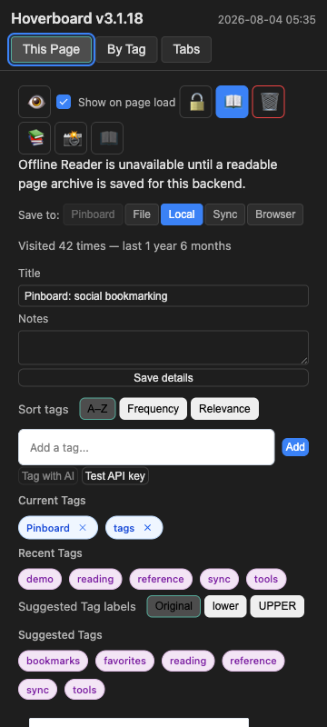
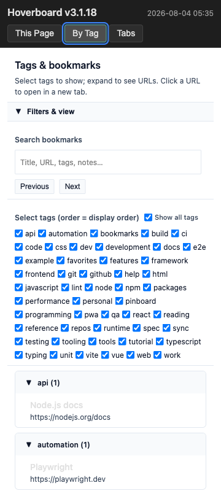
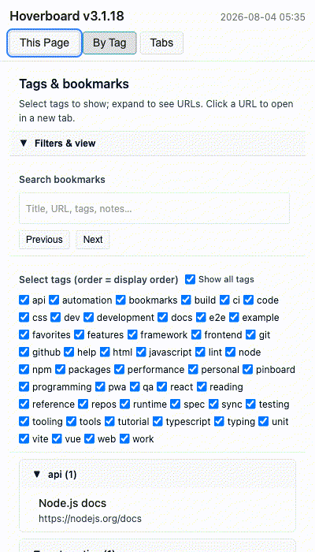
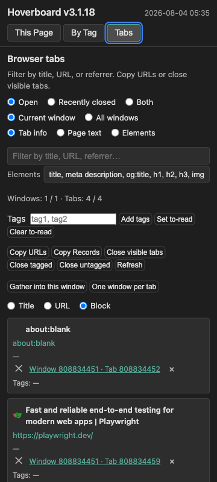
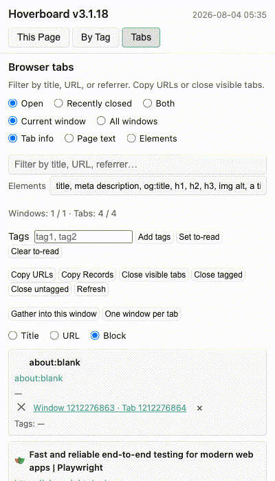
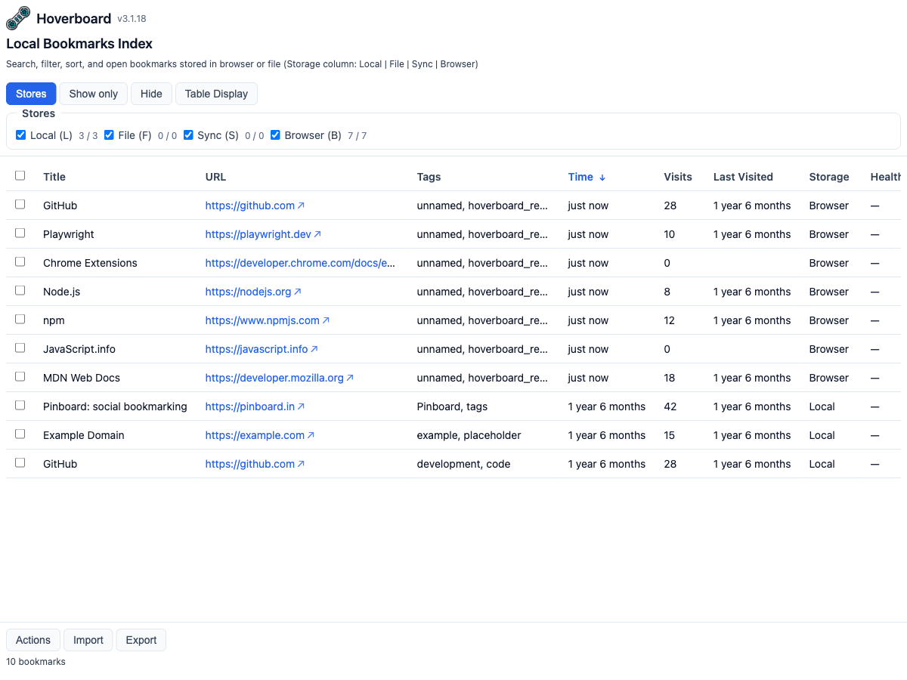
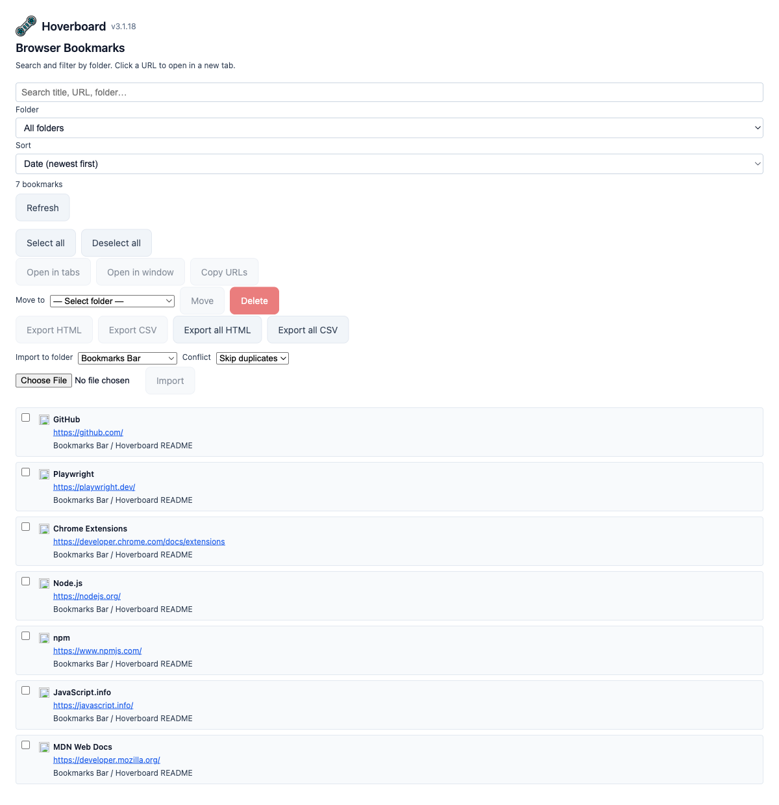
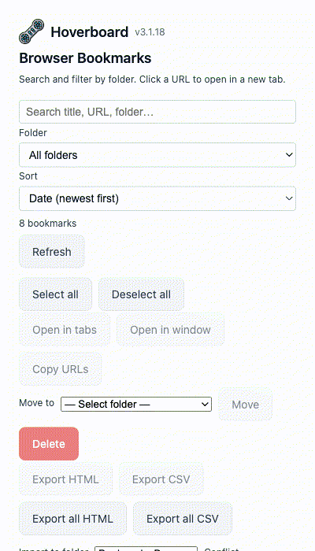
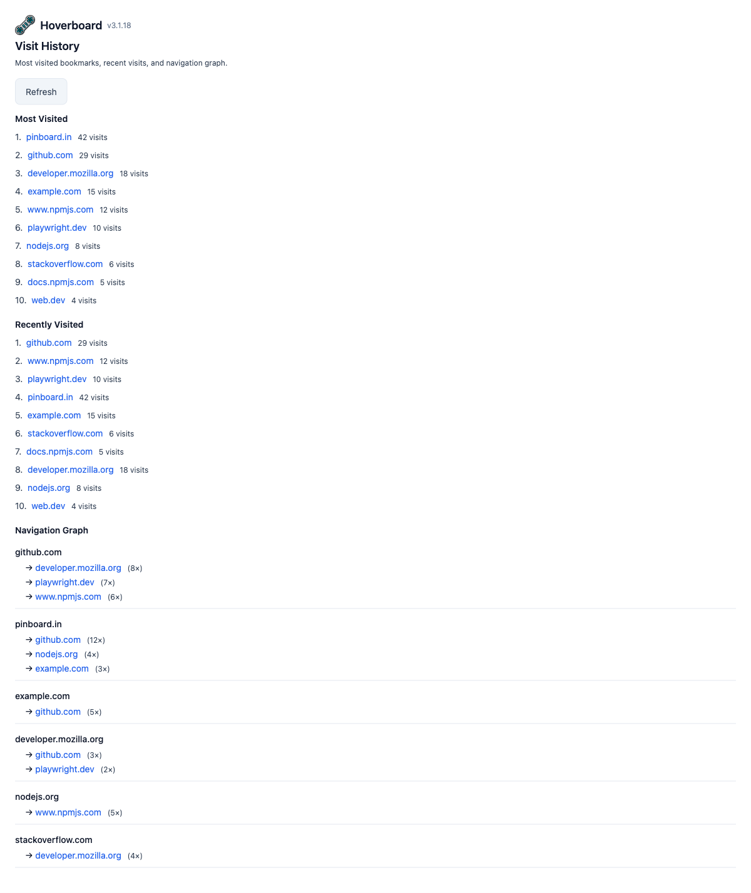
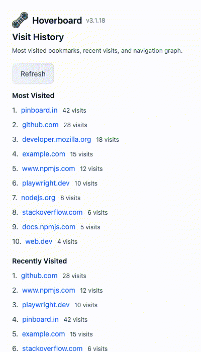

# Hoverboard

Hoverboard is a local-first bookmark and tab workspace for Chromium browsers. Its primary home is the Chrome side panel: tag the current page, browse bookmarks by tag, search and manage tabs, and move from saved pages to durable offline archives.

The popup, badge, and optional on-page overlay remain available as secondary quick-access surfaces. The side panel and its full-page tools are the main workflow.

## The side panel

On supported web pages, clicking the Hoverboard extension icon opens the side panel by default. The panel has three tabs:

### This Page

Manage the bookmark for the active page without leaving the side panel:

- **Quick Actions**: Show Hover, Toggle Privacy, Read Later, Delete, Save page archive, Save page screenshot, and Open offline Reader.
- **Save to**: choose among Pinboard, File, Local, Sync, and Browser storage.
- **Details**: edit the bookmark title and notes where the selected backend supports them.
- **Tags**: add Current Tags, use Recent Tags, inspect Suggested Tags, and choose **Sort tags** by A–Z, Frequency, or Relevance.
- **Tag with AI**: optionally request suggestions from OpenAI or Gemini after configuring an API key in Options.
- **Search Bookmarks**: send a metadata query to the Local Bookmarks Index.
- **Search Tabs**: quickly find an open tab by title; use the Tabs tab for deeper search and tab management.



_This Page example with placeholder bookmark data._


### By Tag

Browse the bookmark library as a hierarchical tag-and-bookmark view. Select tags, show all tags or only selected tags, expand **Filters & view**, and filter by dates, included tags, or domains. Search bookmark titles, URLs, tags, and notes with match counts and Previous/Next navigation. Selecting a URL opens it in a new tab.



_By Tag example with placeholder bookmark data._



### Tabs

Use the Tabs tab as a workspace for open and recently closed browser tabs:

- Choose **Open**, **Recently closed**, or **Both**, and scope the list to the current window or all windows.
- Search in **Tab info**, **Page text**, or **Elements** such as headings, metadata, image alt text, and link titles.
- Display tabs as Title, URL, or full Block cards.
- Add tags in batches, set or clear Read Later, copy URLs or records, close visible/tagged/untagged tabs, and refresh the list.
- **Gather into this window** or **One window per tab** to reorganize visible tabs.

Recently closed tabs can be restored. Page text and Elements searches apply to open pages; closed tabs remain searchable by tab information.



_Tabs example with placeholder browser tabs._



## Full-page tools

The side panel is the workspace for the active browser context. These standalone pages handle larger libraries, native browser data, and analysis:

### Local Bookmarks Index

The **Local Bookmarks Index** is the full-page manager for Hoverboard bookmark records. Its Stores view can include:

- Local storage
- File storage
- Sync storage
- Browser storage (the native Chrome bookmark tree)

The Index supports search by metadata, **Archived content**, or **All resources**; tag, privacy, Read Later, date, domain, and store filters; sorting; visit data; link health checks; and bulk selection. From the Index you can move, delete, add or remove tags, apply regex find-and-replace, import rich CSV/JSON, export records, and use portable library package workflows.

**Browser Bookmark Import** is integrated into the Index. Load the live Chrome bookmark tree, filter by title, URL, or folder, select rows, map folder names to tags, choose Skip/Overwrite/Merge tags, and import into Local, File, or Sync.

See [Bookmark import and export](docs/BOOKMARK_IMPORT_EXPORT.md) for the distinction between rich Hoverboard CSV/JSON, browser bookmark HTML, and live Browser Bookmark Import.



_Local Bookmarks Index example with placeholder data._

### Browser Bookmarks

**Browser Bookmarks** is a standalone full-page manager for the native Chrome bookmark tree, not a side-panel tab. Search by title, URL, or folder path; filter by folder; sort; open selected bookmarks in tabs or a window; move or delete them; undo deletions; and import or export Netscape HTML and CSV.



_Browser Bookmarks example with seeded native bookmark data._



### Visit History

**Visit History** is a standalone full-page view of local bookmark usage:

- **Most Visited**
- **Recently Visited**
- **Navigation Graph** showing referrer-to-URL relationships



_Visit History example with placeholder usage data._



### Offline Reader

**Offline Reader** is a standalone reader for stored page archives. It renders sanitized archived content without fetching the live page and can present archived screenshot artifacts separately.

### Options

Options controls storage, Pinboard authentication, optional AI tagging, native-host connectivity, link health, site exclusions, overlay appearance, text sizes, badge indicators, and extension-icon behavior.

### Tools toolbar

On non-web tabs such as browser settings or extension pages, the side panel is dismissed and the badge opens the **tools toolbar**. It provides launchers for the Local Bookmarks Index, Browser Import in the Index, Options, Browser Bookmarks, and Visit History.

## Search and offline archives

Hoverboard has several intentionally separate search surfaces:

- **Tabs** searches tab information, page text, or selected page Elements.
- **By Tag** searches the displayed bookmark tree and navigates between matches.
- **Search Bookmarks** opens the Local Bookmarks Index with a metadata query.
- The Index searches metadata, stored **Archived content**, or **All resources**. All resources is a read-only cross-resource search scope.

On eligible HTTP(S) pages, **Save page archive** stores a sanitized readable archive and **Save page screenshot** stores a separate screenshot artifact. Durable page archives are currently supported by the Local and File storage backends. The archive remains separate from bookmark metadata, and the Reader opens stored content rather than refetching the live URL.

## Storage and privacy

Hoverboard is local-first: Local storage is the default for new bookmarks and does not require an account or external API. Choose the storage backend that fits the workflow:

| Backend | Use |
| --- | --- |
| **Local** | Browser-local extension storage for offline bookmark management. |
| **File** | A JSON bookmark file in a chosen directory, useful with a cloud-synced folder. Path-based File storage uses the optional native host. |
| **Sync** | Browser-synced storage with an approximately 100 KB quota. |
| **Browser** | Native Chrome bookmarks; tags map to folders, while Private, Read Later, and Notes are not stored in the native tree. |
| **Pinboard** | Optional Pinboard synchronization using an API token. |

Bookmark routing is per URL, so records can be moved between supported backends. Page archives and screenshot artifacts have their own Local/File lifecycle and do not get folded into bookmark metadata.

Optional AI tagging is disabled until an API key is configured. Site exclusions, URL inhibit rules, Private bookmarks, and Read Later provide additional control over where and how Hoverboard operates.

## How to open Hoverboard

- On an HTTP(S) page, click the extension icon to open the side panel by default.
- In Options, disable **Single click on extension icon opens side panel** if the compact popup is preferred.
- On non-web pages, click the icon to open the tools toolbar.
- Use Hoverboard’s context-menu entries or assign commands from `chrome://extensions/shortcuts` for direct access to the side panel, Options, the Index, or Browser Import.

The remaining on-page surface is the optional **overlay** (also called Hover). It appears at the foot of a page when requested or configured for page load, and provides lightweight bookmark status and actions. It is useful for quick feedback, but the side panel is the primary tagging and management interface.

## Supported browsers

Hoverboard uses Chrome Manifest V3 APIs and targets Chromium browsers:

- **Chrome** is the primary target. The side panel requires Chrome 114 or newer.
- **Brave** and other Chromium browsers can generally load the unpacked extension.
- In Brave, the browser’s native sidebar and Hoverboard’s side panel can affect OS window-arrange shortcuts. See [Brave side-panel window arrange](docs/troubleshooting/brave-side-panel-window-arrange.md).
- **Safari is not currently supported.**

## Install and build

### Install a release

1. Download a package from [GitHub Releases](https://github.com/fareedst/hoverboard/releases).
2. Extract it.
3. Open `chrome://extensions` or `brave://extensions`, enable **Developer mode**, choose **Load unpacked**, and select the extracted `dist` directory.

Other Chromium browsers provide an equivalent extension-management page.

### Build from source

```bash
git clone https://github.com/fareedst/hoverboard.git
cd hoverboard
npm install
npm run build:dev
```

Load the `dist` directory—not the repository root—as the unpacked extension. The build bundles the service worker and content-script dependencies required at runtime.

### Optional native host

Install the native host only when using native-host features such as path-based File storage or other local-code integrations:

```bash
npm run build:native
```

The installer scripts are in `native_host/`. After installation, test the connection from Options with **Test native host**. The default local installation directory is `~/.hoverboard/` on macOS/Linux and `%LOCALAPPDATA%\Hoverboard\` on Windows.

## Development

### Common commands

```bash
# Build, lint, type-check, validate the manifest and tokens, and run security checks
npm run build:dev

# Run the Jest suite
npm test

# Run integration tests
npm run test:integration

# Run extension Playwright tests
npm run test:e2e:extension

# Start development mode with rebuilds
npm run dev
```

Before pushing, the broad validation path is:

```bash
npm run validate && npm run test && npm run test:e2e:extension
```

Useful focused commands include `npm run typecheck`, `npm run validate:manifest`, `npm run validate:tokens`, `npm run test:coverage`, `npm run coverage:gap-report`, and `npm run analyze:side-panel`.

## Documentation

- [Architecture documentation](docs/architecture/README.md)
- [Extension messaging protocols](docs/architecture/extension-messaging-protocols.md)
- [Development guide](docs/development/development-guide.md)
- [Bookmark import and export](docs/BOOKMARK_IMPORT_EXPORT.md)
- [Local Query API](docs/LOCAL_API.md)
- [Troubleshooting](docs/troubleshooting/README.md)
- [Contributing](CONTRIBUTING.md)
- [Changelog](CHANGELOG.md)

## License

Hoverboard is licensed under the [MIT License](LICENSE).
