# 🤖 AI Assistant Protocol for Hoverboard Extension
## Complete AI Decision Framework and Validation System

**Version**: 1.0.0  
**Last Updated**: January 2025  
**Status**: ⭐ **ACTIVE** - Core AI-First Development Standard

> 🤖 **Mandatory for All AI Assistants**: This protocol defines explicit decision-making criteria, safety constraints, and validation requirements for all code changes in the Hoverboard extension project.

---

## 📋 **PROTOCOL OVERVIEW**

### 🎯 **Core Objectives**
- **Zero Human Dependency**: Complete AI-driven development capability
- **Consistent Quality**: Standardized decision-making and validation
- **Safety First**: Immutable requirements and safety gates
- **Documentation Integrity**: Self-maintaining, synchronized documentation
- **Bidirectional Traceability**: Code-to-documentation relationship preservation

### 🏗️ **Architecture Integration**
This protocol integrates with:
- **📋 Feature Tracking Matrix**: Central feature registry (`docs/feature-tracking-matrix.md`)
- **🔗 Implementation Tokens**: Bidirectional code traceability (All `src-new/` files)
- **🛡️ Validation Scripts**: Automated compliance checking (`scripts/validate-*.js`)
- **📖 Documentation System**: Comprehensive project documentation (`docs/`)

---

## 🛡️ **4-TIER DECISION FRAMEWORK**

### **Tier 1: Safety Gates (NEVER Override)**

#### **🚨 Critical Safety Requirements**
```yaml
safety_gates:
  test_validation:
    rule: "All tests must pass before any code changes"
    command: "npm test"
    override: "NEVER"
    
  backward_compatibility: 
    rule: "Preserve all existing functionality"
    validation: "No breaking changes to public APIs"
    override: "NEVER"
    
  token_compliance:
    rule: "All code changes include implementation tokens"
    format: "// [PRIORITY] FEATURE-ID: Description - [ACTION] Context"
    override: "NEVER"
    
  validation_scripts:
    rule: "All automated validation checks pass"
    command: "npm run validate:ai-compliance"
    override: "NEVER"
```

#### **🛡️ Immutable Project Requirements**
- **Feature Parity**: All original Hoverboard functionality preserved
- **User Data Safety**: No loss of bookmarks, settings, or configuration
- **API Compatibility**: Pinboard integration remains functional
- **Cross-Browser Support**: Chrome, Firefox, Edge compatibility maintained
- **Performance Standards**: No degradation in load times or responsiveness

### **Tier 2: Scope Boundaries (Strict Limits)**

#### **📋 Feature Scope Validation**
```yaml
scope_boundaries:
  feature_registry_compliance:
    rule: "Changes must relate to existing feature in tracking matrix"
    file: "docs/feature-tracking-matrix.md"
    validation: "Feature ID exists and status allows modifications"
    
  dependency_satisfaction:
    rule: "All blocking dependencies completed before implementation"
    check: "Verify all 'Depends On' features marked '✅ Completed'"
    
  architecture_alignment:
    rule: "Changes consistent with documented architecture patterns"
    reference: "docs/ARCHITECTURE.md"
    validation: "No conflicts with established design principles"
    
  context_cascade:
    rule: "Required documentation updates per change protocol"
    trigger: "Automatic documentation cascade based on change type"
```

### **Tier 3: Quality Thresholds (Must Meet)**

#### **📊 Code Quality Standards**
```yaml
quality_thresholds:
  test_coverage:
    minimum: "80%"
    measurement: "Line coverage for new/modified code"
    enforcement: "Pre-commit validation"
    
  error_handling:
    requirement: "Comprehensive try/catch blocks"
    pattern: "Consistent error handling patterns"
    integration: "ErrorHandler class usage required"
    
  performance_benchmarks:
    startup_time: "<100ms extension load time"
    memory_usage: "<50MB maximum memory footprint"
    bundle_size: "<2MB total extension size"
    
  implementation_tokens:
    coverage: "100% of modified functions"
    format: "Standardized priority and action indicators"
    validation: "Automated token format checking"
```

### **Tier 4: Strategic Alignment (Goal Check)**

#### **🎯 Project Goals Validation**
```yaml
strategic_alignment:
  phase_progression:
    rule: "Changes advance current project phase goals"
    reference: "docs/migration-plan.md"
    validation: "Contributes to documented objectives"
    
  priority_ordering:
    rule: "Implement highest priority tasks first"
    source: "Feature tracking matrix priority indicators"
    validation: "⭐ CRITICAL before 🔺 HIGH before 🔶 MEDIUM"
    
  future_impact:
    consideration: "Enable future work vs create technical debt"
    evaluation: "Long-term maintainability assessment"
    
  reusability:
    principle: "Preserve component extraction and modularity goals"
    validation: "Single responsibility and clean interfaces"
```

---

## 🔄 **CHANGE CLASSIFICATION SYSTEM**

### **Change Type Protocols**

#### **🆕 NEW FEATURE Protocol**
```yaml
new_feature:
  pre_work_validation:
    - feature_registry_entry: "Feature exists with status 'Not Started'"
    - dependencies_satisfied: "All blocking dependencies completed"
    - architecture_review: "Aligns with documented patterns"
    - test_requirements: "Testing strategy defined"
    
  implementation_requirements:
    - implementation_tokens: "All new code includes tokens"
    - error_handling: "Comprehensive error boundaries"
    - documentation: "Code comments and function documentation"
    - testing: "Unit tests with 80%+ coverage"
    
  post_work_validation:
    - all_tests_pass: "npm test returns success"
    - documentation_cascade: "Required docs updated"
    - feature_status_update: "Registry updated to 'Completed'"
    - cross_reference_integrity: "Bidirectional links maintained"
```

#### **🔧 MODIFY EXISTING Protocol**
```yaml
modify_existing:
  pre_work_validation:
    - impact_analysis: "Identify all affected components"
    - regression_risk: "Assess potential breaking changes"
    - token_consistency: "Existing tokens preserved/updated"
    
  implementation_requirements:
    - minimal_scope: "Smallest change set possible"
    - backward_compatibility: "No breaking changes"
    - token_updates: "Modified functions get updated tokens"
    
  post_work_validation:
    - regression_testing: "All existing tests pass"
    - integration_testing: "Component interactions verified"
    - documentation_sync: "Affected documentation updated"
```

#### **🐛 BUG FIX Protocol**
```yaml
bug_fix:
  pre_work_validation:
    - issue_identification: "Clear problem statement"
    - root_cause_analysis: "Understanding of underlying cause"
    - minimal_fix_scope: "Narrowest possible fix"
    
  implementation_requirements:
    - targeted_fix: "Address specific issue only"
    - preserve_functionality: "No unrelated changes"
    - error_handling: "Improve error handling if relevant"
    
  post_work_validation:
    - bug_verification: "Issue demonstrably resolved"
    - regression_check: "No new issues introduced"
    - test_addition: "Test case added to prevent regression"
```

---

## ✅ **MANDATORY VALIDATION CHECKLISTS**

### **🚨 Pre-Work Validation (MANDATORY)**

#### **Before ANY Code Changes:**
```checklist
□ Feature Registry Check
  └── Feature exists in docs/feature-tracking-matrix.md
  └── Feature ID valid and properly formatted
  └── Feature status allows modifications
  
□ Dependency Validation
  └── All "Depends On" features marked "✅ Completed"
  └── No circular dependencies identified  
  └── Integration points documented
  
□ Impact Assessment
  └── All affected files identified
  └── Cross-component impacts understood
  └── Documentation cascade requirements identified
  
□ Safety Gate Verification
  └── No immutable requirements violated
  └── Backward compatibility preserved
  └── Test suite passes (npm test)
```

### **⭐ Post-Work Validation (MANDATORY)**

#### **After ALL Code Changes:**
```checklist
□ Implementation Token Compliance
  └── All modified functions include tokens
  └── Token format matches specification
  └── Priority and action indicators correct
  
□ Quality Assurance
  └── All tests pass (npm test)
  └── Linting passes (npm run lint)
  └── Code coverage meets 80% threshold
  
□ Documentation Synchronization
  └── Feature registry updated if status changed
  └── Architecture documentation updated if needed
  └── Cross-references maintained and validated
  
□ Integration Verification
  └── Extension loads without errors
  └── Core functionality verified
  └── No performance degradation
```

---

## 🔧 **DECISION TREES FOR COMMON SCENARIOS**

### **"Should I implement this feature request?"**

```mermaid
flowchart TD
    A[Feature Request] --> B{Feature exists in registry?}
    B -->|No| C[❌ REJECT - Create feature entry first]
    B -->|Yes| D{All dependencies completed?}
    D -->|No| E[❌ REJECT - Complete dependencies first]
    D -->|Yes| F{Aligns with architecture?}
    F -->|No| G[❌ REJECT - Architecture conflict]
    F -->|Yes| H{Required context identified?}
    H -->|No| I[❌ REJECT - Document context requirements]
    H -->|Yes| J[✅ PROCEED with NEW FEATURE Protocol]
```



### **"Should I fix this test failure?"**

```mermaid
flowchart TD
    A[Test Failure] --> B{Blocking other work?}
    B -->|Yes| C{Critical component?}
    B -->|No| D{High priority feature?}
    C -->|Yes| E[🚨 IMMEDIATE FIX required]
    C -->|No| F{Can fix without breaking functionality?}
    D -->|Yes| G[🔺 HIGH PRIORITY fix]
    D -->|No| H[🔶 MEDIUM PRIORITY - schedule fix]
    F -->|Yes| I[✅ PROCEED with BUG FIX Protocol]
    F -->|No| J[❌ DEFER - Requires architectural review]
```



### **"Should I refactor this code?"**


---

## 📊 **AI ASSISTANT PERFORMANCE METRICS**

### **Success Metrics (Target Values)**

#### **Decision Efficiency**
- **Decision Time**: <2 minutes for change classification
- **First-Time Success**: >90% validation pass rate on first attempt
- **Protocol Compliance**: 100% adherence to decision framework
- **Safety Gate Violations**: 0 violations per development cycle

#### **Quality Maintenance**
- **Test Pass Rate**: 100% all tests passing after changes
- **Documentation Sync**: 100% required documentation updated
- **Token Coverage**: 100% modified code includes implementation tokens
- **Cross-Reference Integrity**: 0 broken references after changes

#### **Development Velocity**
- **Feature Completion Rate**: Target features completed per sprint
- **Rework Minimization**: <5% of changes require rework
- **Documentation Lag**: 0 changes without required documentation updates
- **Integration Success**: 100% changes integrate without conflicts

### **Performance Monitoring**

#### **Real-Time Validation Checks**
```bash
# Automated performance monitoring
./scripts/monitor-ai-performance.sh

# Metrics collected:
- Decision time per change classification
- Validation success rate per protocol
- Documentation completeness percentage  
- Cross-reference integrity status
- Test pass rate trend
- Token coverage percentage
```

---

## 🚀 **INTEGRATION WITH EXISTING SYSTEMS**

### **Git Workflow Integration**

#### **Pre-Commit Hooks**
```bash
#!/bin/bash
# .git/hooks/pre-commit

echo "🤖 Running AI-First Compliance Validation..."

# 1. Validate implementation tokens
if ! ./scripts/validate-tokens.js; then
    echo "❌ Token validation failed"
    exit 1
fi

# 2. Check feature registry consistency  
if ! ./scripts/validate-feature-registry.js; then
    echo "❌ Feature registry validation failed"
    exit 1
fi

# 3. Verify cross-reference integrity
if ! ./scripts/validate-cross-references.js; then
    echo "❌ Cross-reference validation failed"
    exit 1
fi

# 4. Test suite validation
if ! npm test; then
    echo "❌ Test suite validation failed"
    exit 1
fi

echo "✅ All AI-First compliance checks passed"
```

### **CI/CD Pipeline Integration**
```yaml
# .github/workflows/ai-compliance.yml
name: AI-First Compliance Check

on: [push, pull_request]

jobs:
  ai-compliance:
    runs-on: ubuntu-latest
    steps:
      - name: Validate AI Protocol Compliance
        run: |
          npm run validate:ai-compliance
          npm run test:ai-decision-framework
          npm run check:documentation-sync
```

---

## 🎯 **PROTOCOL ENFORCEMENT**

### **Critical Enforcement Points**

#### **Change Rejection Criteria**
- **Missing Feature Registry Entry**: Change lacks valid feature ID
- **Incomplete Dependencies**: Blocking dependencies not completed
- **Safety Gate Violation**: Immutable requirements violated
- **Token Non-Compliance**: Missing or malformed implementation tokens
- **Documentation Inconsistency**: Required documentation not updated

#### **Automatic Approval Criteria**
- **All Safety Gates Pass**: No immutable requirement violations
- **Complete Documentation Cascade**: All required docs updated
- **Token Compliance**: All modified code includes valid tokens
- **Test Suite Success**: 100% test pass rate maintained
- **Cross-Reference Integrity**: Bidirectional references consistent

### **Quality Assurance Integration**

#### **Continuous Monitoring**
```javascript
// Example: Automated compliance monitoring
const AIComplianceMonitor = {
  checkTokenCoverage: async () => {
    // Validate implementation token coverage
  },
  
  validateFeatureRegistry: async () => {
    // Check feature registry consistency
  },
  
  verifyDocumentationSync: async () => {
    // Ensure documentation cascade completion
  },
  
  monitorDecisionMetrics: async () => {
    // Track AI assistant performance metrics
  }
};
```

---

## 🔄 **PROTOCOL EVOLUTION**

### **Continuous Improvement Framework**

#### **Metrics-Driven Enhancement**
- **Decision Framework Optimization**: Based on AI performance metrics
- **Protocol Refinement**: Based on real-world usage patterns
- **Validation Enhancement**: Based on error patterns and edge cases
- **Documentation Evolution**: Based on AI comprehension improvements

#### **Feedback Integration**
- **AI Assistant Performance**: Continuous monitoring and optimization
- **Developer Experience**: Workflow efficiency and friction reduction
- **Quality Outcomes**: Code quality and documentation consistency
- **System Reliability**: Error rates and system stability

---

## 📚 **QUICK REFERENCE**

### **Emergency Decision Matrix**
| Scenario | Immediate Action | Protocol | Priority |
|----------|------------------|----------|----------|
| **Test Failures** | Fix immediately if blocking | BUG FIX | 🚨 CRITICAL |
| **Security Issue** | Address immediately | BUG FIX | 🚨 CRITICAL |  
| **Feature Request** | Check registry first | NEW FEATURE | Per feature priority |
| **Refactoring** | Validate necessity | REFACTORING | 🔶 MEDIUM |
| **Documentation Update** | Follow cascade rules | DOCUMENTATION | Per change type |

### **Key Commands**
```bash
# Validation commands
npm run validate:ai-compliance    # Full compliance check
npm run validate:tokens          # Token format validation  
npm run validate:registry        # Feature registry check
npm run validate:cross-refs      # Cross-reference integrity

# Testing commands  
npm test                        # Full test suite
npm run test:ai-framework       # AI framework specific tests
npm run test:integration        # Integration test suite

# Documentation commands
npm run docs:cascade           # Trigger documentation cascade
npm run docs:validate         # Documentation consistency check
```

---

**🤖 This protocol ensures consistent, high-quality, AI-driven development while maintaining system integrity and documentation accuracy. All AI assistants must adhere to these procedures without exception.**

**📅 Last Updated**: January 2025  
**🔄 Next Review**: Quarterly or after major system changes  
**📋 Compliance**: Mandatory for all AI-driven development activities 