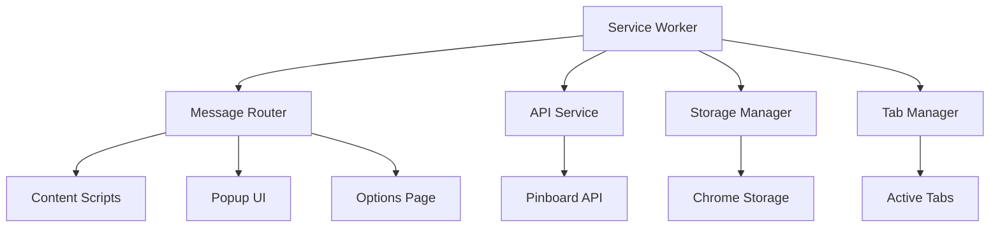
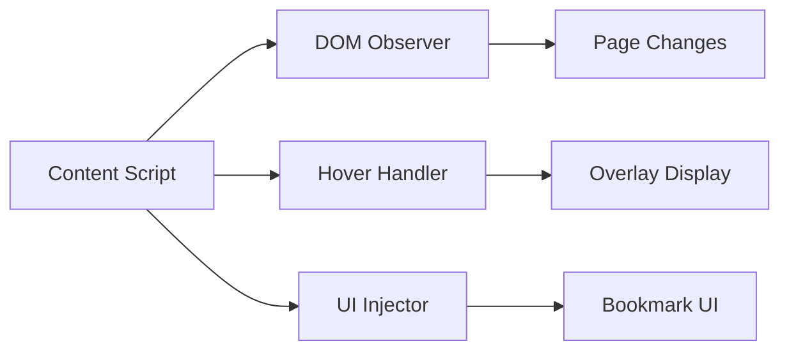
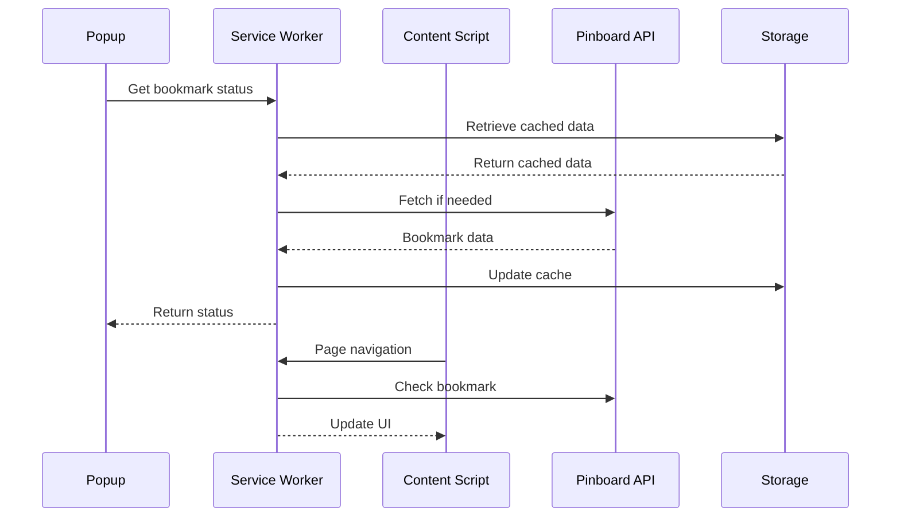
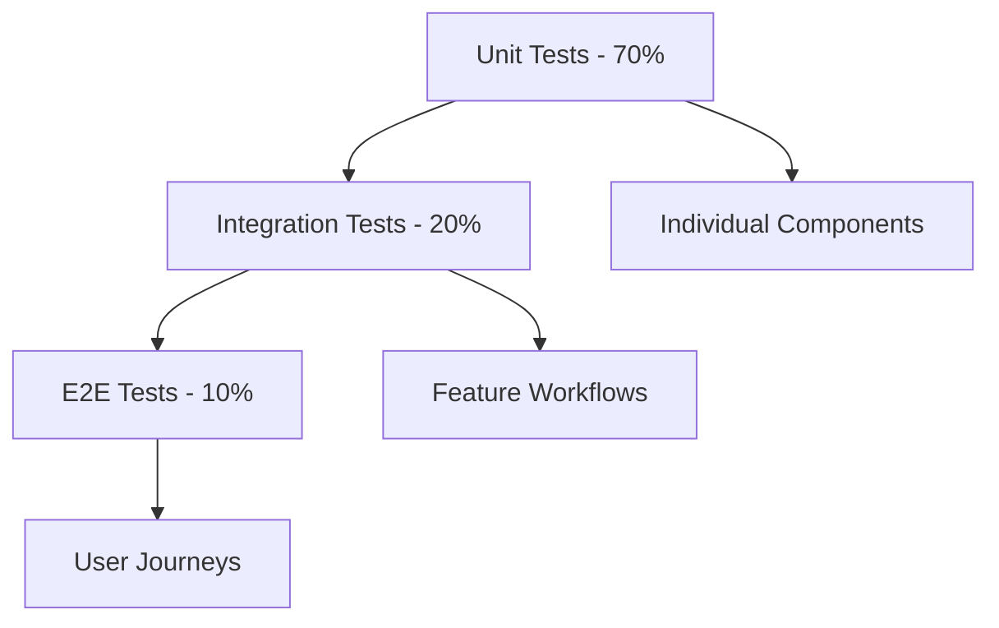
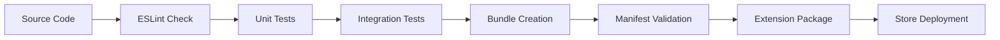

# 🏗️ Hoverboard Extension Architecture

## 📋 Overview

This document provides a comprehensive overview of the Hoverboard browser extension architecture, following modern extension development patterns with Manifest V3 compliance and feature-based organization.

## 🎯 Architecture Principles

### 🔐 Security First
- Manifest V3 compliance with service workers
- Content Security Policy (CSP) compliance
- Minimal permissions with declarative patterns
- Secure data storage and transmission

### 🧩 Modular Design
- Feature-based code organization
- Single responsibility principle
- Dependency injection patterns
- Clean separation of concerns

### ⚡ Performance Optimized
- Lazy loading of components
- Efficient memory management
- Minimal DOM manipulation
- Optimized network requests

### 🔧 Maintainable Codebase
- TypeScript-style documentation
- Comprehensive error handling
- Unit and integration testing
- Standardized coding patterns

## 📁 Project Structure

```
src-new/
├── core/                    # Core extension services
│   ├── service-worker.js    # Background service worker (Manifest V3)
│   ├── message-router.js    # Inter-component communication
│   └── error-handler.js     # Global error handling
├── config/                  # Configuration management
│   └── config-manager.js    # Settings and authentication
├── features/               # Feature modules
│   ├── bookmark/           # Bookmark management
│   ├── tagging/           # Tag management and suggestions
│   ├── hover/             # Hover overlay functionality
│   └── api/               # Pinboard API integration
├── ui/                    # User interface components
│   ├── popup/             # Extension popup
│   ├── options/           # Options/settings page
│   └── content/           # Content script UI
└── shared/                # Shared utilities
    ├── utils.js           # Common utility functions
    ├── constants.js       # Application constants
    └── storage.js         # Storage abstractions
```

## 🔄 Component Architecture

### 🎛️ Service Worker (Background)

The service worker serves as the central coordinator for the extension:



**Responsibilities:**
- Manage extension lifecycle
- Handle background tasks and timers
- Coordinate communication between components
- Manage API authentication and requests
- Handle storage operations

### 📄 Content Scripts

Content scripts handle page-level functionality:



**Responsibilities:**
- Inject hover overlays
- Handle user interactions on web pages
- Communicate bookmark status to service worker
- Manage content-specific UI elements

### 🎨 User Interface Components

#### Popup Interface
- Quick bookmark actions
- Tag suggestions and management
- Settings shortcuts
- Status indicators

#### Options Page
- Authentication configuration
- Feature toggles and preferences
- Import/export functionality
- Advanced settings

## 🔗 Data Flow Architecture

### 📊 State Management



### 🔄 Message Passing System

```javascript
// Message types and routing
const MessageTypes = {
  // Bookmark operations
  GET_BOOKMARK_STATUS: 'get_bookmark_status',
  ADD_BOOKMARK: 'add_bookmark',
  UPDATE_BOOKMARK: 'update_bookmark',
  DELETE_BOOKMARK: 'delete_bookmark',
  
  // Configuration
  GET_CONFIG: 'get_config',
  UPDATE_CONFIG: 'update_config',
  
  // Tag management
  GET_TAGS: 'get_tags',
  GET_TAG_SUGGESTIONS: 'get_tag_suggestions',
  
  // UI updates
  UPDATE_BADGE: 'update_badge',
  SHOW_NOTIFICATION: 'show_notification'
};
```

## 🏭 Service Architecture

### 🔧 Configuration Service

**File:** `src-new/config/config-manager.js`

```javascript
class ConfigManager {
  // Default configuration
  getDefaultConfiguration()
  
  // Configuration management
  getConfig()
  updateConfig(updates)
  resetToDefaults()
  
  // Authentication
  getAuthToken()
  setAuthToken(token)
  hasAuthToken()
  
  // URL inhibition
  getInhibitUrls()
  addInhibitUrl(url)
  isUrlAllowed(url)
}
```

### 🔖 Bookmark Service

**Features:**
- CRUD operations for bookmarks
- Batch operations
- Conflict resolution
- Offline support with sync

### 🏷️ Tag Management Service

**Features:**
- Tag suggestion algorithms
- Recent tags caching
- Tag frequency analysis
- Auto-completion support

### 🌐 API Integration Service

**Features:**
- Pinboard API wrapper
- Rate limiting and retry logic
- Request batching
- Error handling and fallbacks

## 🎨 User Interface Architecture

### 🎭 Design System

**Color Palette:**
- Primary: `#1E40AF` (Blue)
- Secondary: `#374151` (Gray)
- Success: `#059669` (Green)
- Warning: `#D97706` (Orange)
- Error: `#DC2626` (Red)

**Typography:**
- Headers: System font stack
- Body: Inter, -apple-system, BlinkMacSystemFont
- Code: Fira Code, Monaco, monospace

**Spacing Scale:**
- Base unit: 0.25rem (4px)
- Scale: 1x, 2x, 3x, 4x, 6x, 8x, 12x, 16x

### 📱 Responsive Design

The extension UI adapts to different contexts:

- **Popup**: 320px width, variable height
- **Options**: Full-page responsive layout
- **Content overlays**: Contextual positioning

## 🔒 Security Architecture

### 🛡️ Content Security Policy

```json
{
  "content_security_policy": {
    "extension_pages": "script-src 'self'; object-src 'self'",
    "content_scripts": "script-src 'self'; object-src 'self'"
  }
}
```

### 🔐 Permission Model

**Required Permissions:**
- `storage`: Configuration and cache storage
- `activeTab`: Current tab access for bookmark detection
- `scripting`: Content script injection

**Host Permissions:**
- `https://api.pinboard.in/*`: Pinboard API access

### 🔒 Data Security

- **Authentication tokens**: Encrypted storage
- **User data**: Local storage with sync backup
- **API requests**: HTTPS only with certificate pinning
- **Content isolation**: Sandbox for content scripts

## 📈 Performance Architecture

### ⚡ Optimization Strategies

1. **Lazy Loading**
   - Load UI components on demand
   - Defer non-critical script loading
   - Progressive feature activation

2. **Caching**
   - Intelligent bookmark cache
   - Tag suggestion cache
   - API response caching with TTL

3. **Memory Management**
   - Cleanup event listeners
   - Release DOM references
   - Garbage collection optimization

4. **Network Optimization**
   - Request batching
   - Conditional requests (ETags)
   - Offline-first patterns

### 📊 Performance Metrics

- **Cold start**: < 100ms
- **UI response**: < 16ms (60fps)
- **API requests**: < 2s average
- **Memory usage**: < 50MB peak

## 🧪 Testing Architecture

### 🔬 Testing Pyramid



### 🛠️ Testing Tools

- **Unit Testing**: Jest with jsdom
- **Integration Testing**: Jest with chrome extension mocks
- **E2E Testing**: Puppeteer with real browser instances
- **Coverage**: 80%+ target for critical paths

## 🚀 Deployment Architecture

### 📦 Build Pipeline



### 🔄 Release Strategy

1. **Development**: Feature branches with continuous integration
2. **Staging**: Release candidates with full testing
3. **Production**: Stable releases with gradual rollout

### 📈 Monitoring

- **Error tracking**: Sentry integration
- **Performance monitoring**: Chrome extension metrics
- **User analytics**: Privacy-respecting usage statistics

## 🔧 Development Workflow

### 🛠️ Setup

```bash
# Install dependencies
npm install

# Start development mode
npm run dev

# Run tests
npm test

# Build for production
npm run build:prod
```

### 🧪 Testing Workflow

```bash
# Unit tests
npm run test:unit

# Integration tests
npm run test:integration

# E2E tests
npm run test:e2e

# Full test suite with coverage
npm run test:ci
```

### 📦 Release Workflow

```bash
# Quality checks
npm run quality:check

# Build release
npm run build:prod

# Validate extension
npm run validate

# Package for store
npm run package
```

## 📚 Additional Resources

- [Migration Documentation](../migration/README.md)
- [Development Setup Guide](../development/README.md)
- [Troubleshooting Guide](../troubleshooting/README.md)
- [Getting Started Guide](../getting-started/README.md)
- [Reference Documentation](../reference/README.md) 