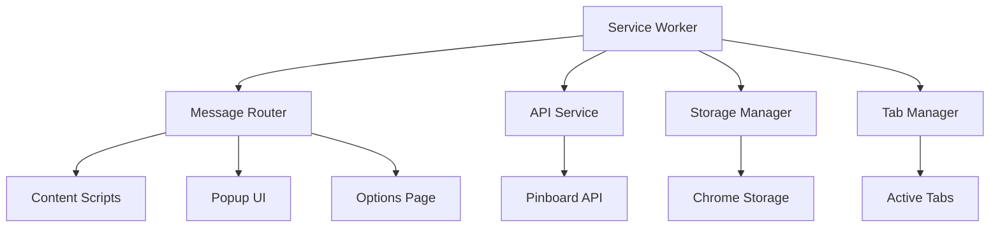
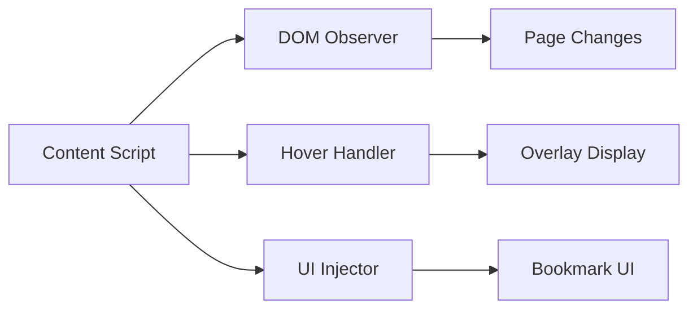
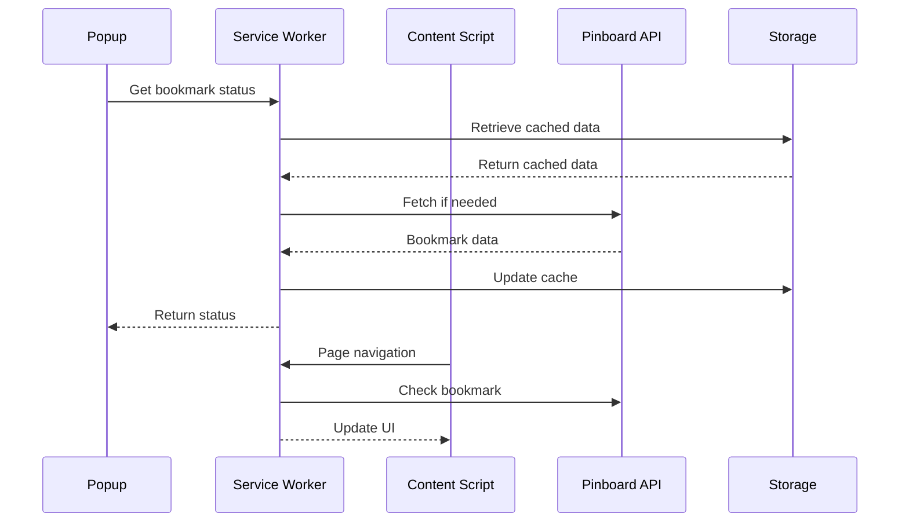

# 🏗️ Hoverboard Extension Architecture

## 📋 Overview

This document provides a comprehensive overview of the Hoverboard browser extension architecture, following modern extension development patterns with Manifest V3 compliance and feature-based organization.

## 🎯 Architecture Principles

### 🔐 Security First
- Manifest V3 compliance with service workers
- Content Security Policy (CSP) compliance
- Minimal permissions with declarative patterns
- Secure data storage and transmission

### 🧩 Modular Design
- Feature-based code organization
- Single responsibility principle
- Dependency injection patterns
- Clean separation of concerns

### ⚡ Performance Optimized
- Lazy loading of components
- Efficient memory management
- Minimal DOM manipulation
- Optimized network requests

### 🔧 Maintainable Codebase
- TypeScript-style documentation
- Comprehensive error handling
- Unit and integration testing
- Standardized coding patterns

## 📁 Project Structure

```
src-new/
├── core/                    # Core extension services
│   ├── service-worker.js    # Background service worker (Manifest V3)
│   ├── message-router.js    # Inter-component communication
│   └── error-handler.js     # Global error handling
├── config/                  # Configuration management
│   └── config-manager.js    # Settings and authentication
├── features/               # Feature modules
│   ├── bookmark/           # Bookmark management
│   ├── tagging/           # Tag management and suggestions
│   ├── hover/             # Hover overlay functionality
│   └── api/               # Pinboard API integration
├── ui/                    # User interface components
│   ├── popup/             # Extension popup
│   ├── options/           # Options/settings page
│   └── content/           # Content script UI
└── shared/                # Shared utilities
    ├── utils.js           # Common utility functions
    ├── constants.js       # Application constants
    └── storage.js         # Storage abstractions
```

## 🦊🧭 Cross-Browser API Abstraction and Debug Logging [SAFARI-EXT-SHIM-001] (2025-07-15)

To enable future Safari (and Firefox) support, a browser API abstraction layer has been implemented in `src/shared/utils.js` using `webextension-polyfill` with a fallback to `chrome` for Chrome compatibility. All extension code should import `{ browser }` from this module instead of using `chrome.*` directly. This abstraction is accompanied by debug logs (using the logger framework) to trace module loading and API resolution, ensuring robust diagnostics during migration and future platform support.

- **Semantic Token:** `[SAFARI-EXT-SHIM-001]` is used in code and documentation for traceability.
- **Debug Logging:** All major consumers of the abstraction log their loading process and the resolved browser API object.
- **Tested:** The abstraction and logging have been tested and verified to work in Chrome, with no regression.
- **Next Steps:** This foundation enables a smooth path to Safari extension support with minimal code changes.

See also: `src/shared/utils.js` and related debug logs in `pinboard-service.js`, `tag-service.js`, and `PopupController.js`.

## 🔄 Component Architecture

### 🎛️ Service Worker (Background)

The service worker serves as the central coordinator for the extension:



**Responsibilities:**
- Manage extension lifecycle
- Handle background tasks and timers
- Coordinate communication between components
- Manage API authentication and requests
- Handle storage operations

### 📄 Content Scripts

Content scripts handle page-level functionality:



**Responsibilities:**
- Inject hover overlays
- Handle user interactions on web pages
- Communicate bookmark status to service worker
- Manage content-specific UI elements

### 🎨 User Interface Components

#### Popup Interface
- Quick bookmark actions
- Tag suggestions and management
- Settings shortcuts
- Status indicators

#### Options Page
- Authentication configuration
- Feature toggles and preferences
- Import/export functionality
- Advanced settings

## 🔗 Data Flow Architecture

### 📊 State Management



### 🔄 Message Passing System

```javascript
// Message types and routing
const MessageTypes = {
  // Bookmark operations
  GET_BOOKMARK_STATUS: 'get_bookmark_status',
  ADD_BOOKMARK: 'add_bookmark',
  UPDATE_BOOKMARK: 'update_bookmark',
  DELETE_BOOKMARK: 'delete_bookmark',
  
  // Configuration
  GET_CONFIG: 'get_config',
  UPDATE_CONFIG: 'update_config',
  
  // Tag management
  GET_TAGS: 'get_tags',
  GET_TAG_SUGGESTIONS: 'get_tag_suggestions',
  
  // UI updates
  UPDATE_BADGE: 'update_badge',
  SHOW_NOTIFICATION: 'show_notification'
};
```

## 🏭 Service Architecture

### 🔧 Configuration Service

**File:** `src-new/config/config-manager.js`

```javascript
class ConfigManager {
  // Default configuration
  getDefaultConfiguration()
  
  // Configuration management
  getConfig()
  updateConfig(updates)
  resetToDefaults()
  
  // Authentication
  getAuthToken()
  setAuthToken(token)
  hasAuthToken()
  
  // URL inhibition
  getInhibitUrls()
  addInhibitUrl(url)
  isUrlAllowed(url)
}
```

### 🔖 Bookmark Service

**Features:**
- CRUD operations for bookmarks
- Batch operations
- Conflict resolution
- Offline support with sync

### 🏷️ Tag Management Service

**Features:**
- Tag suggestion algorithms
- Recent tags caching
- Tag frequency analysis
- Auto-completion support

### 🌐 API Integration Service

**Features:**
- Pinboard API wrapper
- Rate limiting and retry logic
- Request batching
- Error handling and fallbacks

## 🎨 User Interface Architecture

### 🎭 Design System

**Color Palette:**
- Primary: `#1E40AF` (Blue)
- Secondary: `#374151` (Gray)
- Success: `