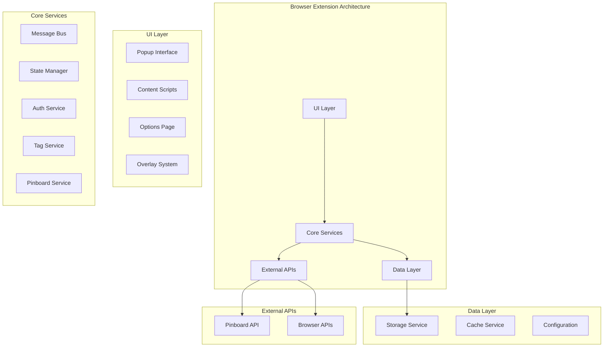

# 🏗️ Structured Development Framework

## 📑 Purpose
This document establishes the development framework, documentation standards, and process enforcement mechanisms for the Hoverboard browser extension migration, following the proven patterns from the BkpDir project architecture.

## ⭐ CRITICAL DEVELOPMENT PRINCIPLES

### 🔗 STDD Reference

**⚠️ IMPORTANT**: All requirements, architecture decisions, and implementation decisions are now coordinated through the STDD folder:

- **Requirements**: See `stdd/requirements.md` for all immutable and functional requirements
- **Architecture Decisions**: See `stdd/architecture-decisions.md` for architectural choices
- **Implementation Decisions**: See `stdd/implementation-decisions.md` for implementation details
- **Semantic Tokens**: See `stdd/semantic-tokens.md` for token registry
- **Tasks**: See `stdd/tasks.md` for active task tracking
- **AI Principles**: See `stdd/ai-principles.md` for development process

### 🛡️ Immutable Requirements

**All immutable requirements are documented in `stdd/requirements.md`:**

- `[REQ:EXTENSION_IDENTITY]` - Extension Identity Preservation
- `[REQ:CORE_UX_PRESERVATION]` - Core User Experience Preservation
- `[REQ:MANIFEST_V3_MIGRATION]` - Manifest V3 Migration
- `[REQ:PINBOARD_COMPATIBILITY]` - Pinboard API Compatibility
- `[REQ:CHROME_STORAGE_USAGE]` - Chrome Storage API Usage
- `[REQ:RECENT_TAGS_SYSTEM]` - Recent Tags System

**Key principles that cannot be changed:**
1. **Feature Parity**: All existing functionality must be preserved
2. **User Data**: No loss of user settings, bookmarks, or configuration
3. **API Compatibility**: Pinboard API integration must remain functional
4. **Cross-Browser**: Support for Chrome, Firefox, Edge, and future Safari support via unified browser API abstraction
5. **Performance**: No degradation in extension load times or responsiveness
6. **Security**: Maintain or improve current security posture

### 📋 Mandatory Change Protocol

#### **🚨 CRITICAL: Before ANY Code Changes**
1. **🔍 Feature Analysis**: Document what feature you're implementing
2. **📝 Impact Assessment**: Identify all affected components
3. **🧪 Test Requirements**: Define testing criteria for changes
4. **📖 Documentation Update**: Plan required documentation updates, including semantic tokens for new cross-browser features and debug logging ([SAFARI-EXT-SHIM-001]).

#### **⭐ Change Type Classification**
| Change Type | Icon | Documentation Required | Testing Required |
|-------------|------|----------------------|------------------|
| **New Feature** | 🆕 | Full documentation cascade | Comprehensive testing |
| **Modify Existing** | 🔧 | Impact analysis required | Regression testing |
| **Bug Fix** | 🐛 | Minimal documentation | Focused testing |
| **Refactoring** | 🔄 | Structural documentation | Unit testing |
| **Configuration** | ⚙️ | Configuration focus | Config testing |

## 🏗️ Architecture Framework

### 📊 System Architecture Overview



### 🧩 Component Relationships

#### **🔥 Critical Dependencies (Must Implement First)**
```
ExtensionCore.js (Foundation)
    ├── MessageBus.js (Communication)
    ├── StateManager.js (State)
    ├── ErrorHandler.js (Error Handling)
    └── ConfigManager.js (Configuration)
```

#### **🔺 High Priority Dependencies**
```
Service Layer
    ├── StorageService.js (Data Persistence)
    ├── AuthService.js (Authentication)
    ├── PinboardService.js (API Integration)
    └── TagService.js (Tag Management)
```

#### **🔶 Medium Priority Dependencies**
```
UI Components
    ├── BaseComponent.js (UI Foundation)
    ├── PopupManager.js (Popup Interface)
    ├── ContentManager.js (Content Scripts)
    └── OverlayManager.js (Overlay System)
```

## 📝 Feature Tracking System

### 🎯 Feature Registry Template

#### **Feature ID Format**: `[CATEGORY]-[NUMBER]: [DESCRIPTION]`

**Categories:**
- **EXT**: Extension core functionality
- **UI**: User interface components
- **SVC**: Service layer components
- **CFG**: Configuration system
- **API**: External API integration
- **TEST**: Testing infrastructure

#### **Feature Documentation Template**

```markdown
### **EXT-001: Extension Core Architecture**
**Priority**: ⭐ CRITICAL | **Status**: 🔄 In Progress | **Owner**: Developer

**📑 Purpose**: Implement the core extension architecture with service worker and message passing.

**🔧 Implementation Summary**: Modern service worker architecture replacing legacy background scripts.

**📋 Subtasks:**
1. **[⭐] Service Worker Implementation** - CRITICAL
   - [x] Create service worker entry point
   - [x] Implement lifecycle management
   - [ ] Set up message routing
   - [ ] Configure persistent state

2. **[🔺] Message Bus System** - HIGH
   - [ ] Design message protocol
   - [ ] Implement pub/sub pattern
   - [ ] Add error handling
   - [ ] Create debugging tools

**🎯 Success Criteria:**
- Service worker starts successfully
- Message passing works between components
- Extension lifecycle is properly managed
- Error handling is comprehensive

**🧪 Testing Requirements:**
- Unit tests for core components
- Integration tests for message passing
- Performance tests for startup time
- Cross-browser compatibility tests

**📝 Implementation Tokens**: `// EXT-001: Core architecture`
```

### 🔍 Implementation Token System

#### **Token Format**: `// [FEATURE-ID]: [DESCRIPTION]`

**Examples:**
```javascript
// EXT-001: Core architecture - Service worker initialization
class ExtensionCore {
  async initialize() {
    // Implementation
  }
}

// UI-003: Popup interface - Tag component rendering
class TagComponent extends BaseComponent {
  render() {
    // EXT-001: Core architecture - Message bus integration
    this.messageBus.subscribe('tag-updated', this.handleTagUpdate);
  }
}
```

## 🧪 Testing Framework

### 📊 Testing Strategy Matrix

| Component Type | Unit Tests | Integration Tests | E2E Tests | Performance Tests |
|----------------|------------|-------------------|-----------|-------------------|
| **Core Services** | ✅ Required | ✅ Required | ⚠️ Conditional | ✅ Required |
| **UI Components** | ✅ Required | ✅ Required | ✅ Required | ⚠️ Conditional |
| **API Integration** | ✅ Required | ✅ Required | ✅ Required | ✅ Required |
| **Configuration** | ✅ Required | ⚠️ Conditional | ⚠️ Conditional | ❌ Not Required |
| **Utilities** | ✅ Required | ❌ Not Required | ❌ Not Required | ❌ Not Required |

### 🔧 Test Implementation Requirements

#### **Unit Testing Standards**
```javascript
// TEST-001: Unit testing framework
describe('PinboardService', () => {
  beforeEach(() => {
    // Setup test environment
  });

  test('should fetch pin for URL', async () => {
    // EXT-002: Pinboard integration test
    const service = new PinboardService(mockAuth, mockHttp);
    const result = await service.fetchPinForUrl('https://example.com');
    
    expect(result).toBeDefined();
    expect(result.url).toBe('https://example.com');
  });
});
```

#### **Integration Testing Standards**
```javascript
// TEST-002: Integration testing framework
describe('Extension Integration', () => {
  test('popup communicates with service worker', async () => {
    // EXT-001: Core architecture integration test
    const popup = new PopupManager();
    const response = await popup.requestTagData();
    
    expect(response.tags).toBeArray();
  });
});
```

## 📋 Documentation Framework

### 📖 Required Documentation Types

#### **1. Architecture Documentation** (⭐ CRITICAL)
- System overview and component relationships
- Data flow diagrams
- API specifications
- Security model

#### **2. Implementation Documentation** (🔺 HIGH)
- Code comments using implementation tokens
- Function and class documentation
- Configuration options
- Error handling patterns

#### **3. User Documentation** (🔶 MEDIUM)
- Installation and setup guides
- Feature usage instructions
- Troubleshooting guides
- Migration notes for existing users

#### **4. Developer Documentation** (🔶 MEDIUM)
- Development environment setup
- Build and deployment processes
- Testing procedures
- Contributing guidelines

### 📝 Documentation Standards

#### **Code Comment Standards**
```javascript
/**
 * PinboardService - Handles all Pinboard API interactions
 * 
 * Implementation Token: SVC-002
 * Dependencies: AuthService, HttpClient, CacheService
 * 
 * @class PinboardService
 * @since 2.0.0
 */
class PinboardService {
  /**
   * Fetches bookmark data for a specific URL
   * 
   * @param {string} url - The URL to fetch bookmark data for
   * @param {Object} options - Additional options for the request
   * @returns {Promise<BookmarkData>} The bookmark data
   * @throws {PinboardError} When API request fails
   * 
   * Implementation Token: SVC-002: URL bookmark fetching
   */
  async fetchPinForUrl(url, options = {}) {
    // Implementation
  }
}
```

## 🔒 Quality Assurance Framework

### 🛡️ Code Quality Standards

#### **ESLint Configuration**
```javascript
// .eslintrc.js - EXT-001: Code quality standards
module.exports = {
  extends: [
    'eslint:recommended',
    '@typescript-eslint/recommended'
  ],
  rules: {
    // Enforce implementation tokens in functions
    'require-implementation-token': 'error',
    // Require JSDoc for public methods
    'require-jsdoc': ['error', {
      require: {
        FunctionDeclaration: true,
        MethodDefinition: true,
        ClassDeclaration: true
      }
    }],
    // Enforce consistent naming
    'naming-convention': 'error'
  }
};
```

#### **Pre-commit Hooks**
```json
{
  "pre-commit": [
    "lint-staged",
    "test-changed",
    "check-implementation-tokens",
    "validate-documentation"
  ]
}
```

### 📊 Performance Standards

#### **Performance Metrics**
- **Extension Startup**: < 100ms to interactive
- **API Response**: < 500ms for Pinboard requests
- **Memory Usage**: < 50MB total extension memory
- **Bundle Size**: < 2MB total extension size

#### **Performance Testing**
```javascript
// TEST-003: Performance testing framework
describe('Performance Tests', () => {
  test('extension starts within time limit', async () => {
    const startTime = performance.now();
    await ExtensionCore.initialize();
    const endTime = performance.now();
    
    expect(endTime - startTime).toBeLessThan(100);
  });
});
```

## 🚀 Deployment Framework

### 📦 Build Pipeline

#### **Build Configuration**
```javascript
// webpack.config.js - EXT-001: Build system
module.exports = {
  entry: {
    serviceWorker: './src/core/ServiceWorker.js',
    popup: './src/ui/popup/index.js',
    content: './src/content/ContentManager.js',
    options: './src/ui/options/index.js'
  },
  output: {
    path: path.resolve(__dirname, 'dist'),
    filename: '[name].bundle.js'
  },
  // Additional configuration
};
```

#### **Release Process**
1. **🔍 Pre-release Validation**
   - All tests pass
   - Documentation is complete
   - Implementation tokens are validated
   - Performance benchmarks are met

2. **📦 Build & Package**
   - Create production builds
   - Generate source maps
   - Create extension packages
   - Sign extension packages

3. **🚀 Deployment**
   - Deploy to staging environment
   - Run final integration tests
   - Deploy to extension stores
   - Update documentation

### 🔄 Continuous Integration

#### **CI Pipeline**
```yaml
# .github/workflows/ci.yml - EXT-001: CI/CD pipeline
name: Extension CI/CD

on: [push, pull_request]

jobs:
  test:
    runs-on: ubuntu-latest
    steps:
      - uses: actions/checkout@v2
      - name: Setup Node.js
        uses: actions/setup-node@v2
        with:
          node-version: '18'
      - name: Install dependencies
        run: npm ci
      - name: Run linting
        run: npm run lint
      - name: Run tests
        run: npm run test:ci
      - name: Check implementation tokens
        run: npm run check-tokens
      - name: Build extension
        run: npm run build
```

## 📞 Process Enforcement

### 🛡️ Validation Automation

#### **Implementation Token Validation**
```bash
#!/bin/bash
# scripts/validate-tokens.sh - EXT-001: Token validation

echo "Validating implementation tokens..."

# Check for missing tokens in new functions
missing_tokens=$(grep -r "function\|class\|=>" src/ | grep -v "// [A-Z]+-[0-9]")

if [ ! -z "$missing_tokens" ]; then
  echo "❌ Missing implementation tokens found:"
  echo "$missing_tokens"
  exit 1
fi

echo "✅ All implementation tokens validated"
```

#### **Documentation Validation**
```bash
#!/bin/bash
# scripts/validate-docs.sh - EXT-001: Documentation validation

echo "Validating documentation..."

# Check for outdated documentation
outdated_docs=$(find docs/ -name "*.md" -exec grep -l "TODO\|FIXME\|XXX" {} \;)

if [ ! -z "$outdated_docs" ]; then
  echo "⚠️ Documentation needs updates:"
  echo "$outdated_docs"
fi

echo "✅ Documentation validation complete"
```

### 📋 Review Checklist

#### **Code Review Requirements**
- [ ] **Implementation Tokens**: All new code has proper tokens
- [ ] **Documentation**: All public APIs are documented
- [ ] **Testing**: Appropriate tests are included
- [ ] **Performance**: No performance regressions
- [ ] **Security**: Security implications are considered
- [ ] **Compatibility**: Cross-browser compatibility is maintained

#### **Architecture Review Requirements**
- [ ] **Design Patterns**: Follows established patterns
- [ ] **Separation of Concerns**: Clean separation maintained
- [ ] **Dependency Management**: Dependencies are properly managed
- [ ] **Error Handling**: Comprehensive error handling
- [ ] **Scalability**: Design supports future growth
- [ ] **Maintainability**: Code is maintainable and readable

---

**🎯 Success Criteria**: This framework ensures systematic, documented, and validated development throughout the migration process, maintaining high quality standards while preserving all existing functionality.

**📅 Framework Implementation**: Implement this framework in Phase 1 before beginning any code migration to ensure consistent development practices throughout the project. 